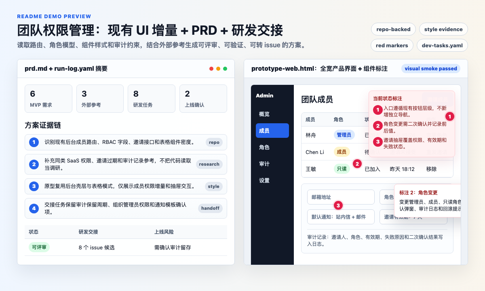
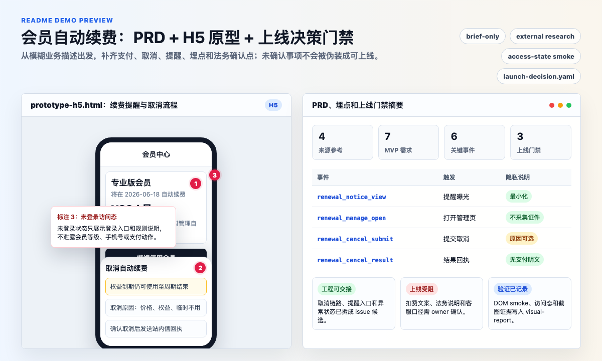

# PM Copilot

<p align="center"><a href="README.md">简体中文</a> | <strong>English</strong></p>

<a id="english"></a>

PM Copilot is an open-source, platform-neutral Agent Workflow Kit for product managers. It helps a PM turn an ambiguous product request into practical handoff artifacts: a complete PRD, a source-first annotated UI deliverable, source-extracted standalone HTML handoffs, and structured reference documents or document prototypes when the work is knowledge-heavy.

中文简介：PM Copilot 是面向产品经理的开源 AI Agent 工作流套件，支持生成 PRD、需求文档、埋点方案、源码优先的带标注 UI 交付物、研发交接和上线决策材料。

The project is intentionally not a web app, CLI, or Figma plugin. It is a reusable repository of agent definitions, skills, prompt rules, memory rules, artifact contracts, workflow rules, guardrails, and templates that can be adapted to agent environments such as Codex, Claude Code, Cursor, or internal agent platforms.

PM Copilot supports three context modes: `repo-backed`, `document-backed`, and `brief-only`. The agent should choose the mode from available inputs before drafting, so it does not require a code repository when product documents or a short brief are the actual starting point.

## Language Support

PM Copilot treats English and Chinese as first-class user-facing languages. Generated PM artifacts, UI delivery labels, annotations, review findings, readiness statuses, and validation notes should follow the user's language with the same workflow, artifact set, and quality bar. File names, event names, property names, requirement IDs, and other machine-readable identifiers stay ASCII for portability.

## What It Produces

- `prd.md` suitable for product, design, engineering, QA, and analytics review
- Version history, requirement input, clarified answers, assumptions, and open confirmations inside the PRD
- Research and reference findings, prioritizing external competitor, comparable feature, user-research, or public solution sources; current implementation is treated as product context and engineering constraint
- Requirement list and detailed requirement tables with logic, content, rules, interactions, data, permissions, edge states, tracking links, and acceptance links
- Goals, metrics, tracking plan, and flow diagrams inside the PRD
- Annotated UI deliverable for Web, H5, App, or Mini Program scenarios. When frontend source exists, the default is a source-backed preview or delta patch. If the PM needs an independent HTML handoff, the agent should first render the target region in the original project or user-approved current-repo implementation and then use `extract_ui_region.py` to produce an annotated `prototype-<platform>.html` or offline `index.html` with editable annotation configuration. Local compatibility HTML is only for no-source work, explicit portable HTML without source implementation, explicit redesign/greenfield requests, or concrete source-rendering blockers.
- Structured reference delivery for document-class requests such as parameter tables, capability matrices, rule references, data dictionaries, SOPs/runbooks, or migration inventories. When the user explicitly says no PRD is needed, PM Copilot should not force one.
- Document prototype HTML that presents reference content with navigation, tables, hierarchical fields, source/review status, and typed `attention_points` instead of ordinary product-page annotations.
- `run-log.yaml` as an internal trace when useful, not as the PM-facing deliverable
- Tool preflight, delivery orchestration, HTML parsing, browser screenshots, and optional visual diff validation for compatibility HTML UI deliverables; missing Playwright/browser tooling should trigger setup before any skipped status is recorded
- Optional `dev-tasks.yaml` and `launch-decision.yaml` for controlled engineering handoff and release decision support

## Quick Start

For direct agent usage, see `docs/direct-use.md`. For embedded project usage, see `docs/embedded-use.md`.

1. Open this repository in your agent-enabled workspace.
2. Ask the agent to read `PM_COPILOT.md`, then say your product-manager request naturally, for example: `I need a PRD, tracking plan, and H5 UI deliverable for membership auto-renewal optimization.`
3. The agent should inspect relevant context, ask must-answer clarification questions before generation, then create `prd.md` and the matching UI deliverable automatically.
4. Optional: create local memory files later for better product-specific results and personal working preferences.

Suggested prompt:

```text
We want to improve the H5 membership auto-renewal experience. Users say renewal reminders are unclear, the cancellation entry is hard to find, and support tickets are increasing.

If important information is missing, ask me first.
If enough information is available, create `prd.md` and the matching UI deliverable.
```

## Two Practical Demos

Paste either request into an agent-enabled workspace. PM Copilot should classify the context mode first, load the required agents, skills, contracts, and tooling rules, ask blocking questions when required, and generate the PRD, UI deliverable, run trace, and optional handoff artifacts only after the clarification gate passes.

### Demo 1: Team Permission Management in an Existing Project

Use this to show that PM Copilot does more than write generic docs: it should inspect the current repository and fit the requirement into existing routes, role models, permission logic, UI components, and analytics conventions while separating external references from current-product context and engineering handoff work.



```text
We need team permission management in the admin console.

Please inspect the existing routes, role model, member management page, permission checks, analytics conventions, and component patterns first.
Do a small amount of external comparable-product research, but do not treat repository files as competitor research.
If important information is missing, ask me before generation.
If enough information is available, create the PRD, a Web UI deliverable, and issue-ready engineering tasks.
```

A useful run should produce:

| Artifact | What to look for |
|---|---|
| `outputs/team-permissions/prd.md` | Target users, current-product constraints, external reference findings, MVP/optional/future scope, member invites, role changes, permission blocking, audit logs, loading/empty/error/no-permission states |
| Web UI deliverable | When frontend source exists, a source-backed preview route, Storybook/demo, or `source_delta_patch` that reuses the existing admin shell, component library, and table density; when an independent HTML handoff is required, a `source_extract_html` file derived from the source preview or user-approved current-repo implementation; compatibility HTML fallback is only for explicit portable HTML without source implementation or blocked source rendering |
| `outputs/team-permissions/dev-tasks.yaml` | Issue-ready engineering tasks, dependencies, acceptance criteria, test notes, likely host files, and blocking confirmations |
| `outputs/team-permissions/run-log.yaml` | Context mode, host project files loaded, external research sources, style evidence, existing UI baseline, tool validation, and unresolved risks |

This demo highlights `repo-backed` context loading, separation of external research from repository context, Chinese or English PRDs, existing-UI source-backed deltas, red component annotations, engineering handoff, and permission/edge-state coverage.

### Demo 2: Membership Auto-Renewal Optimization Without a Code Repository

Use this to show that PM Copilot can start from a brief or product documents, without requiring a code repository, and still handle higher-risk product requirements involving payment, cancellation, reminders, tracking, privacy, and launch gates.



```text
We want to improve the H5 membership auto-renewal experience. Users say renewal reminders are unclear, the cancellation entry is hard to find, and support tickets are increasing.

The business goal is to reduce renewal-related complaints without materially hurting membership retention.
If you need current billing rules, reminder timing, cancellation paths, support scripts, legal requirements, or metric definitions, ask me first.
When enough information is available, create the PRD, H5 UI deliverable, tracking plan, and launch decision recommendation.
```

A useful run should produce:

| Artifact | What to look for |
|---|---|
| `outputs/membership-renewal/prd.md` | User problem, business goals, external references, current assumptions, reminder strategy, cancellation flow, payment/support/legal risks, acceptance criteria, and launch status |
| `outputs/membership-renewal/prototype-h5.html` | Compatibility HTML UI deliverable for no-code/document-backed starts, covering membership center entry, renewal reminder, auto-renewal management, cancellation confirmation, result receipt, logged-out/no-membership/API-failure states |
| Tracking table inside the PRD | Events such as `renewal_notice_view`, `renewal_manage_open`, `renewal_cancel_submit`, `renewal_cancel_result`, plus privacy notes |
| `outputs/membership-renewal/launch-decision.yaml` | Engineering-ready scope, launch blockers, legal/payment/support owners, rollback recommendation, and missing human approvals |
| `outputs/membership-renewal/run-log.yaml` | Clarifying questions, default assumptions, external research status, access-state visual validation, tool results, and unresolved gates |

This demo highlights `document-backed` or `brief-only` mode, localized delivery, mobile UI deliverables, access-state coherence, metrics and tracking, explicit payment/privacy/legal risk handling, and separated engineering handoff versus launch decision status.

## Use Inside an Existing Project

This is the expected setup when you want to import PM Copilot into a real software project:

```text
host-repo/
|-- AGENTS.md or CLAUDE.md or .cursor/rules/
|-- src/
`-- pm-copilot/
    `-- PM_COPILOT.md
```

Copy or clone this repository into the host project as `pm-copilot/`, then install a small adapter in the host repository root:

```bash
cd host-repo/pm-copilot
python3 scripts/install_adapter.py --host .. --tool all
```

The adapter is required for reliable embedded use. Simply placing the `pm-copilot/` folder inside another project does not guarantee that Codex, Claude Code, Cursor, or another agent will automatically discover nested instructions.

In embedded mode, PM Copilot should inspect the current host project before drafting. Existing routes, data models, UI patterns, permissions, analytics conventions, and docs should shape the new requirement; the agent should not assume a greenfield product unless you ask for one.

After the adapter is installed, users can ask natural PM requests from the host project without naming PM Copilot:

```text
Help me write the PRD and UI deliverable for team permission management.
```

For details and manual adapter snippets, see `docs/embedded-use.md`.

## Use Without a Code Repository

PMs do not need a software repository to use PM Copilot. If the product context lives in documents, place or attach the relevant files in the workspace and ask naturally.

Useful context can include:

- Historical PRDs, specs, and release notes
- Product docs, screenshots, wireframes, and UI delivery notes
- Research summaries, user feedback, support tickets, and meeting notes
- Analytics exports, KPI definitions, and existing tracking plans
- Business rules, compliance constraints, pricing notes, and rollout plans

PM Copilot should read those documents as the current product context, ask must-answer questions when the documents are insufficient, and then generate `prd.md` and the UI deliverable after the clarification gate passes.

## Repository Structure

```text
PM_COPILOT.md  Canonical cross-platform PM Copilot entry
adapters/      Host-project adapters for Codex, Claude Code, Cursor
agents/        Agent roles, responsibilities, inputs, outputs, handoffs
skills/        Reusable PM methods and task skills
prompts/       Prompt assembly, memory use, clarification, and generation rules
context/       Product memory, user preferences, decisions, business rules, metrics
workflow/      State machine, human checkpoints, execution order
artifacts/     Output contracts and quality bars
tools/         Tool registry, tool-use protocol, and capability-specific tooling notes
guardrails/    Safety, privacy, source, assumption, and failover rules
templates/     Reusable artifact templates
docs/          User, maintainer, and release documentation
scripts/       Lightweight local validation
```

## Core Workflow

```text
Request intake
-> Tool preflight
-> Current product context scan
-> Requirement clarification
-> User answer or explicit assumption approval
-> PRD with goals, research, requirements, metrics, tracking, and flows
-> Multi-platform UI deliverable, or structured reference / document prototype
-> Delivery check
```

The default interaction mode is "clarify before generation." If must-answer information is missing, the agent should ask and stop before creating PRD or UI deliverables. It should continue only after the user answers or explicitly accepts assumption risk. PRD status, engineering handoff status, and launch status are separate: engineering-blocking confirmations prevent `Ready for engineering`, while launch-only blockers must remain visible with owner and required confirmation.

For reference, policy, medical, legal, financial, safety, or operational content, PM Copilot records source status, review owner, review status, disclaimer status, and launch impact. Unreviewed content must be labeled as placeholder or draft even when the surrounding product framework is ready for engineering.

Each real requirement run gets one generated-artifact folder under `outputs/<run-id>/`, normally containing `prd.md`, a UI-deliverable reference, and optionally `run-log.yaml`. The run id uses an English kebab-case requirement name plus day-precision date, for example `membership-renewal-2026-05-18`; same-day collisions append `-2`, `-3`, and so on. In a repo with frontend source, the UI deliverable defaults to source-backed preview/delta files recorded in `run-log.yaml`; when the user asks to implement the UI in the current repository first and then hand off a 1:1 artifact, PM Copilot should run the implemented host UI and extract the target region into source-derived HTML. Compatibility `prototype-<platform>.html` files are generated only for no-source work, explicit portable HTML without source implementation, explicit redesign/greenfield UI, or concrete source-rendering blockers. Offline folder handoffs may also use `index.html` as the entry file in the same run folder. The `outputs/` folder is generated at runtime and is not shipped with example artifacts. If the target git repository cannot be found but a same-name source folder exists on the Desktop, files may be written there and the user should push from that folder.

When compatibility HTML UI deliverables are generated, PM Copilot should run `python3 scripts/validate_prototype_visual.py outputs/<run-id>`. For source-backed UI previews, it should run the host dev/preview/Storybook/simulator path; when a browser preview URL or local preview file exists, run `python3 scripts/validate_ui_preview.py <preview-url-or-file> --run-folder outputs/<run-id>`, otherwise record equivalent screenshot or simulator evidence. If Playwright or browser tooling is missing, it should first run or guide `python3 scripts/setup_visual_validation.py`; a skipped status is allowed only after setup fails, the environment forbids browser launch, or the user declines installation. Before final delivery, prefer `python3 scripts/run_delivery_checks.py outputs/<run-id> --language en` and store tool evidence under `outputs/<run-id>/tool-results/`. When the user asks for engineering handoff or release readiness, the same run folder may also contain `dev-tasks.yaml` and `launch-decision.yaml`.

PM Copilot follows the user's language for generated artifacts: Chinese requests should produce Chinese headings, labels, statuses, notes, and PM content; English requests should produce English equivalents. File names and machine-readable identifiers stay ASCII.

## Memory

PM Copilot uses local file-based memory so repeated use can become smoother without a hosted service:

- `context/product-memory.local.yaml` for stable product facts
- `context/user-preferences.local.yaml` for the user's working style
- `context/decision-log.local.yaml` for durable product decisions
- `outputs/<run-id>/run-log.yaml` for single-run traces
- `outputs/<run-id>/tool-results/delivery-check-report.json` for delivery-orchestrator tool evidence
- `outputs/<run-id>/visual-review/visual-report.json` for UI screenshot and visual diff evidence after setup succeeds
- `outputs/<run-id>/dev-tasks.yaml` for issue-ready engineering handoff when requested
- `outputs/<run-id>/launch-decision.yaml` for launch decision support when requested

The repository ships `.example.yaml` schemas only. `.local.yaml` memory files are ignored by Git and should stay private. Current user instructions and current product context always override memory.

## Platform-Neutral Design

PM Copilot avoids dependency on a specific agent framework. Each agent and skill is written as a portable Markdown contract:

- Agents define ownership, inputs, outputs, decision points, handoffs, and failover behavior.
- Skills define reusable procedures, standards, and artifact rules.
- Prompt rules define request classification, memory use, clarification behavior, and generation boundaries.
- Artifact contracts define required output shape and minimum quality.
- Guardrails define what the agent must not fabricate or silently assume.

## Skill Layer

`skills/` stores reusable product-work methods. `PM_COPILOT.md` and the agents load only the skills that match the current request, so the full skill set does not enter context by default.

| Group | Skills |
|---|---|
| Intake and scope | `requirement-intake`, `opportunity-discovery`, `feedback-synthesis`, `process-mapping`, `knowledge-ops`, `scope-edge-cases` |
| PRD and delivery | `prd-writing`, `user-stories`, `user-flow`, `acceptance-criteria`, `review-checklist`, `artifact-packaging`, `development-handoff` |
| Metrics and data | `metrics-tree`, `tracking-plan`, `experiment-design`, `product-ops-analysis` |
| Research and communication | `competitor-research`, `roadmap-communication` |
| UI delivery and UI evidence | `multi-platform-prototype` (including screenshot/image-to-UI reconstruction), `design-system-audit` |
| Tool and capability governance | `tool-vetting`, `sharingan`, `skill-cleaner` |

Each capability type has one canonical skill. External resources absorbed with `skills/sharingan/SKILL.md` go through risk review and merge into the canonical skill instead of creating duplicates.

## External Tool Governance

PM Copilot can connect to tools such as Figma, browser validation, document systems, project management, analytics, CRM, and automation platforms, but a tool is not considered usable just because it appears in a recommendation list.

- `tools/external-tool-catalog.json` records candidate tools, source type, cost risk, credential requirements, data risk, permission boundary, and fallback.
- `agents/integration-governance-agent.md` and `skills/tool-vetting/SKILL.md` vet tools before use.
- `python3 scripts/preflight_integrations.py --tier recommended` checks recommended tools for local runtime conditions, missing credentials, and candidate status.
- Tools that require API keys, OAuth, commercial accounts, workspace permissions, or write actions are optional and cannot be silently enabled.
- Database, analytics, CRM, support, advertising, and collaboration tools default to read-only or least privilege. Sending messages, publishing, changing spend, editing tickets, or writing records requires explicit user approval.

## Documentation

- `README.md` - Chinese README
- `docs/direct-use.md` - direct one-shot agent usage
- `docs/embedded-use.md` - using PM Copilot inside another development repository
- `docs/configuration.md` - product context configuration
- `docs/quality-rubric.md` - manual scoring rubric for generated PRD/UI deliveries
- `docs/optimization-playbook.md` - real-task optimization loop
- `docs/failure-taxonomy.md` - failure classification and fix mapping
- `docs/versioning.md` - versioning and compatibility policy
- `docs/release-checklist.md` - release readiness checklist
- `tools/tool-registry.yaml` - tool capability registry
- `artifacts/tool-result-contract.md` - tool result contract
- `docs/en/contributing-guide.md` - contribution rules
- `docs/en/security-policy.md` - security and privacy policy
- `CHANGELOG.md` - detailed version history

## Feedback and Contributions

Use GitHub issues to share real usage feedback:

- Bug reports: `.github/ISSUE_TEMPLATE/bug_report.md`
- Feature requests: `.github/ISSUE_TEMPLATE/feature_request.md`
- Scenario requests: `.github/ISSUE_TEMPLATE/scenario_request.md`

Synthetic or anonymized product context is preferred. Do not post private product data, credentials, unreleased financials, or real user data in public issues.

## Embedded Install

When PM Copilot is nested inside another development repository, install a small adapter into the host project:

```bash
python3 scripts/install_adapter.py --host /path/to/host-repo --tool all
```

After that, users can ask natural PM requests without saying the project name.

## Validation

Run:

```bash
python3 scripts/preflight_tools.py --strict
python3 scripts/validate_repo.py
```

The GitHub workflow in `.github/workflows/validate.yml` runs the same validator on pushes and pull requests.

To validate a generated output folder during a PM Copilot run:

```bash
python3 scripts/run_delivery_checks.py outputs/<run-id> --language en
python3 scripts/validate_outputs.py outputs/<run-id> --language en
```

If delivery depends on external research or source checks, run `python3 scripts/preflight_tools.py --check-network <url> --require-network --strict`. When `--prototype` is omitted, `validate_prototype_visual.py` validates every supported compatibility HTML file in the run folder; source-backed previews use `validate_ui_preview.py` for browser evidence.

## Optimization

PM Copilot should be improved through real task runs, traces, quality scoring, failure classification, and regression cases.

Start with:

- `docs/optimization-playbook.md`
- `docs/self-improvement-system.md`
- `docs/failure-taxonomy.md`
- `docs/quality-rubric.md`
- `templates/agent-run-log-template.yaml`
- `templates/dev-tasks-template.yaml`
- `templates/launch-decision-template.yaml`
- `templates/evaluation-case-template.md`

For continuous improvement, run:

```bash
python3 scripts/agent_improvement_scorecard.py
```

## Privacy Default

Use local files by default. Do not paste sensitive production data, user personal data, private credentials, unreleased financials, or confidential partner details unless your environment is approved for that data. When real business context is needed, prefer anonymized examples and sampled metrics.

## License

MIT License. See `LICENSE`.
