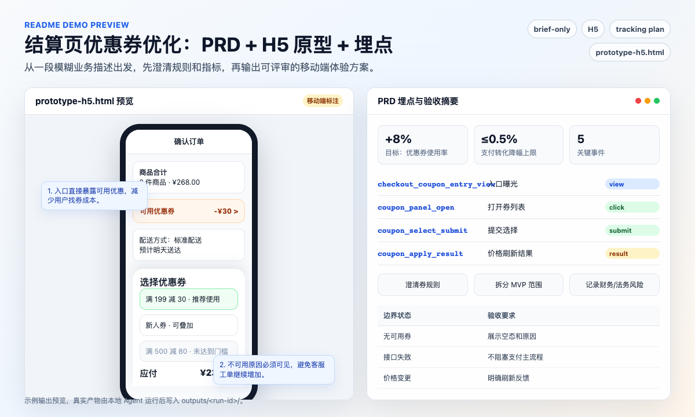

# PM Copilot

<h2 align="center">简体中文 | <a href="#english">English</a></h2>

<a id="zh-cn"></a>

PM Copilot 是一个开源、平台中立的产品经理 Agent Workflow Kit。它帮助产品经理把模糊的产品需求转化为两个可交接成果：完整 PRD 和带标注的可点击原型。

项目刻意不做成 Web 应用、CLI 或 Figma 插件，而是提供一套可复用的仓库资产：Agent 定义、技能、提示词规则、记忆规则、产物契约、工作流规则、护栏和模板。它可以适配 Codex、Claude Code、Cursor 或内部 Agent 平台等环境。

PM Copilot 支持三种上下文模式：`repo-backed`、`document-backed`、`brief-only`。Agent 应该根据可用输入先判断模式再开始起草，因此不要求每次都有代码仓库；如果产品文档或一段简要需求才是起点，也可以正常工作。

## 语言支持

PM Copilot 将中文和英文都视为一等用户语言。生成的 PM 产物、原型文案、原型标注、评审发现、就绪状态和验证说明都应跟随用户语言，并保持同一套工作流、产物范围和质量标准。文件名、事件名、属性名、需求 ID 和其他机器可读标识保持 ASCII，便于跨平台使用。

## 产出内容

- 适合产品、设计、研发、QA 和数据分析评审的 `prd.md`
- PRD 内的版本记录、需求输入、澄清答案、假设和待确认事项
- 调研和参考结论，包括竞品、用户、历史 PRD、当前实现或技术方案参考
- 需求列表和详细需求表，覆盖逻辑、内容、规则、交互、数据、权限、边界状态、埋点链接和验收链接
- PRD 内的目标、指标、埋点方案和流程图
- 适用于 Web、H5、App 或小程序场景的本地可点击标注 HTML 原型
- 必要时作为内部追踪使用的 `run-log.yaml`，不作为面向 PM 的交付件
- 工具预检、交付总控校验、HTML 解析、浏览器截图和可选视觉差异验证；缺少 Playwright/浏览器时先运行安装辅助脚本
- 按需生成用于研发交接和上线决策支持的 `dev-tasks.yaml` 和 `launch-decision.yaml`

## 快速开始

直接使用 Agent 时请看 `docs/direct-use.md`。嵌入到现有项目中使用时请看 `docs/embedded-use.md`。

1. 在支持 Agent 的工作区中打开本仓库。
2. 让 Agent 读取 `PM_COPILOT.md`，然后自然描述你的产品经理需求，例如：`我需要一份结算页优惠券优化的 PRD 和埋点方案。`
3. Agent 应先检查相关上下文，生成前询问必须澄清的问题，然后自动创建 `prd.md` 和原型。
4. 可选：之后创建本地记忆文件，以便获得更贴合产品和个人工作习惯的结果。

推荐提示词：

```text
我们想优化结算页优惠券使用体验。用户反馈找不到优惠券入口，客服工单也在增加。

如果关键信息缺失，请先问我。
如果信息足够，请创建 `prd.md` 和对应的可点击原型。
```

## 两个可直接试的 Demo

把下面任一请求直接粘贴给支持 Agent 的工作区。PM Copilot 会先识别上下文模式，缺关键信息时先问问题；信息足够后再生成 PRD、可点击原型和可选交接材料。

### Demo 1：已有项目里的团队权限管理

适合证明 PM Copilot 不只是写通用文档，而是会读取现有代码仓库，贴合当前产品结构、权限模型、路由和 UI 习惯。


```text
我们要在后台管理端做团队权限管理。

请先检查现有项目里的路由、角色模型、成员管理页面、权限判断和组件风格。
如果关键信息不够，请先问我。
如果信息足够，请输出 PRD、Web 可点击标注原型，并补一份可转 issue 的研发任务拆分。
```

一次有效运行应能产出：

| 产物 | 应该看到什么 |
|---|---|
| `outputs/team-permissions/prd.md` | 目标用户、当前产品约束、MVP/可选/未来范围、成员邀请、角色变更、权限拦截、审计记录、加载/空/错误/无权限状态 |
| `outputs/team-permissions/prototype-web.html` | 后台成员列表、邀请抽屉、角色变更确认、权限提示、逐条编号产品标注 |
| `outputs/team-permissions/dev-tasks.yaml` | 可转 issue 的研发任务、依赖关系、验收标准、测试建议 |
| `outputs/team-permissions/run-log.yaml` | 读取过的宿主项目文件、使用的假设、阻塞项、验证命令和结果 |

这个 Demo 重点展示：`repo-backed` 上下文读取、中文 PRD、Web 原型、埋点设计、研发交接、权限和边界状态覆盖。

### Demo 2：没有代码仓库的结算页优惠券优化

适合证明 PM Copilot 可以从一段模糊业务描述或产品文档出发，不依赖代码仓库，也能生成可评审的产品方案。



```text
我们想优化 H5 结算页优惠券使用体验。用户反馈找不到优惠券入口，客服工单也在增加。

业务目标是提升优惠券使用率，同时不要明显拉低支付转化率。
如果需要我补充现有规则、优惠券类型、不可用原因或指标口径，请先问我。
信息足够后，请输出 PRD、H5 可点击标注原型和埋点方案。
```

一次有效运行应能产出：

| 产物 | 应该看到什么 |
|---|---|
| `outputs/checkout-coupon/prd.md` | 用户问题、业务目标、指标口径、优惠券入口、可用/不可用券、默认推荐、异常状态、发版风险和验收标准 |
| `outputs/checkout-coupon/prototype-h5.html` | 结算页入口、优惠券列表弹层、不可用原因、选择后价格刷新、移动端标注 |
| PRD 内埋点表 | `checkout_coupon_entry_view`、`coupon_select_submit`、`coupon_apply_result` 等事件和属性字典 |
| `outputs/checkout-coupon/run-log.yaml` | 澄清问题、默认假设、是否存在未确认促销/财务/法务风险、验证记录 |

这个 Demo 重点展示：`document-backed` 或 `brief-only` 模式、中文交付、移动端原型、指标和埋点、促销规则风险显性化。

## 在现有项目中使用

如果要把 PM Copilot 引入真实软件项目，推荐结构如下：

```text
host-repo/
|-- AGENTS.md or CLAUDE.md or .cursor/rules/
|-- src/
`-- pm-copilot/
    `-- PM_COPILOT.md
```

将本仓库复制或 clone 到宿主项目的 `pm-copilot/` 目录，然后在宿主仓库根目录安装一个小型适配器：

```bash
cd host-repo/pm-copilot
python3 scripts/install_adapter.py --host .. --tool all
```

嵌入式使用时适配器是必要的。仅把 `pm-copilot/` 文件夹放入另一个项目，并不能保证 Codex、Claude Code、Cursor 或其他 Agent 自动发现嵌套说明。

在嵌入模式下，PM Copilot 起草前应先检查当前宿主项目。现有路由、数据模型、UI 模式、权限、埋点约定和文档都会影响新需求；除非你明确要求绿地方案，Agent 不应假设这是一个全新产品。

适配器安装后，用户可以在宿主项目中直接提出自然语言 PM 需求，无需点名 PM Copilot：

```text
帮我写团队权限管理的 PRD 和可点击原型。
```

详情和手动适配器片段请看 `docs/embedded-use.md`。

## 不依赖代码仓库使用

产品经理不需要软件仓库也可以使用 PM Copilot。如果产品上下文在文档里，把相关文件放入或附加到工作区，然后自然提问即可。

可用上下文包括：

- 历史 PRD、规格文档和发版记录
- 产品文档、截图、线框图和原型说明
- 调研摘要、用户反馈、客服工单和会议纪要
- 分析导出、KPI 定义和现有埋点方案
- 业务规则、合规约束、定价说明和灰度计划

PM Copilot 应把这些文档作为当前产品上下文读取；当文档不足时先询问必须回答的问题；澄清门通过后再生成 `prd.md` 和原型。

## 仓库结构

```text
PM_COPILOT.md  跨平台 PM Copilot 主入口
adapters/      Codex、Claude Code、Cursor 等宿主项目适配器
agents/        Agent 角色、职责、输入、输出和交接
skills/        可复用的 PM 方法和任务技能
prompts/       提示词组装、记忆使用、澄清和生成规则
context/       产品记忆、用户偏好、决策、业务规则和指标
workflow/      状态机、人工检查点和执行顺序
artifacts/     输出契约和质量标准
tools/         工具注册表、使用协议和分能力工具说明
guardrails/    安全、隐私、来源、假设和故障转移规则
templates/     可复用产物模板
evals/         面向回归的评估用例
docs/          用户、维护者和发版文档
scripts/       轻量级本地校验
```

## 核心工作流

```text
需求接收
-> 工具预检
-> 当前产品上下文扫描
-> 需求澄清
-> 用户回答或明确批准假设
-> 包含目标、调研、需求、指标、埋点和流程的 PRD
-> 多平台可点击原型
-> 交付检查
```

默认交互模式是“先澄清，再生成”。如果缺少必须回答的信息，Agent 应先提问并停止，不创建 PRD 或原型交付件。只有在用户回答或明确接受假设风险后才继续。PRD 状态、研发交接状态和上线状态是相互独立的：阻塞研发交接的确认项会阻止标记为“可交接研发”；只阻塞上线的事项必须保留 owner 和所需确认。

对于政策、医疗、法律、金融、安全或运营内容，PM Copilot 会记录来源状态、评审 owner、评审状态、免责声明状态和上线影响。未经评审的内容必须标记为占位或草稿，即使周边产品框架已经可以交接研发。

每次真实需求运行都会在 `outputs/<run-id>/` 下生成一个产物目录，通常包含 `prd.md`、`prototype-<platform>.html`，可选包含 `run-log.yaml`。`outputs/` 目录在运行时生成，不随仓库发布示例产物。如果推断出的 run id 已存在，PM Copilot 应追加本地时间戳，例如 `checkout-coupon-20260518-1430`。

生成 UI 原型时，PM Copilot 应运行 `python3 scripts/validate_prototype_visual.py outputs/<run-id>`。如果缺少 Playwright 或浏览器工具，应先运行或引导 `python3 scripts/setup_visual_validation.py`；只有安装失败、环境禁止启动浏览器，或用户拒绝安装时，才允许记录跳过原因。最终交付前应优先运行 `python3 scripts/run_delivery_checks.py outputs/<run-id> --language zh`，并把工具证据写入 `outputs/<run-id>/tool-results/`。当用户请求研发交接或上线就绪检查时，同一个运行目录也可以包含 `dev-tasks.yaml` 和 `launch-decision.yaml`。

PM Copilot 会跟随用户语言生成产物：中文请求应生成中文标题、标签、状态、说明和 PM 内容；英文请求应生成英文等价内容。文件名和机器可读标识保持 ASCII。

## 记忆

PM Copilot 使用本地文件记忆，让重复使用更顺手，同时不依赖托管服务：

- `context/product-memory.local.yaml` 存放稳定产品事实
- `context/user-preferences.local.yaml` 存放用户工作风格
- `context/decision-log.local.yaml` 存放长期产品决策
- `outputs/<run-id>/run-log.yaml` 存放单次运行追踪
- `outputs/<run-id>/tool-results/delivery-check-report.json` 存放交付总控工具报告
- `outputs/<run-id>/visual-review/visual-report.json` 存放完成 Playwright/浏览器安装或配置后的原型截图和视觉差异证据
- `outputs/<run-id>/dev-tasks.yaml` 存放按需生成、可转 issue 的研发交接内容
- `outputs/<run-id>/launch-decision.yaml` 存放按需生成的上线决策支持内容

仓库只提供 `.example.yaml` schema。`.local.yaml` 记忆文件会被 Git 忽略，应保持私有。当前用户指令和当前产品上下文始终优先于记忆。

## 平台中立设计

PM Copilot 不绑定特定 Agent 框架。每个 Agent 和技能都是可移植的 Markdown 契约：

- Agent 定义职责、输入、输出、决策点、交接和故障转移行为。
- 技能定义可复用流程、标准和产物规则。
- 提示词规则定义需求分类、记忆使用、澄清行为和生成边界。
- 产物契约定义必要输出结构和最低质量标准。
- 护栏定义 Agent 不能编造或静默假设的内容。

## 文档

- `README.en.md` - 英文 README
- `docs/direct-use.md` - 直接一次性 Agent 使用方式
- `docs/embedded-use.md` - 在另一个开发仓库内使用 PM Copilot
- `docs/configuration.md` - 产品上下文配置
- `docs/quality-rubric.md` - 生成 PRD 和原型交付的人工评分标准
- `docs/optimization-playbook.md` - 真实任务优化循环
- `docs/failure-taxonomy.md` - 失败分类和修复映射
- `docs/versioning.md` - 版本和兼容性策略
- `docs/release-checklist.md` - 发版就绪清单
- `tools/tool-registry.yaml` - 工具能力注册表
- `artifacts/tool-result-contract.md` - 工具结果契约
- `CONTRIBUTING.md` - 贡献规则
- `SECURITY.md` - 安全和隐私策略
- `CHANGELOG.md` - 详细版本历史

## 反馈和贡献

欢迎通过 GitHub issues 提交真实使用反馈：

- Bug 反馈：`.github/ISSUE_TEMPLATE/bug_report.md`
- 功能建议：`.github/ISSUE_TEMPLATE/feature_request.md`
- 场景请求：`.github/ISSUE_TEMPLATE/scenario_request.md`

请优先使用合成或脱敏的产品上下文。不要在公开 issue 中提交私有产品数据、凭证、未公开财务信息或真实用户数据。

## 嵌入式安装

当 PM Copilot 嵌套在另一个开发仓库内时，在宿主项目中安装小型适配器：

```bash
python3 scripts/install_adapter.py --host /path/to/host-repo --tool all
```

安装后，用户可以直接提出自然 PM 需求，无需说出项目名。

## 校验

运行：

```bash
python3 scripts/preflight_tools.py --strict
python3 scripts/validate_repo.py
```

`.github/workflows/validate.yml` 中的 GitHub workflow 会在 push 和 pull request 上运行同一校验器。

在 PM Copilot 运行期间校验生成目录：

```bash
python3 scripts/run_delivery_checks.py outputs/<run-id> --language zh
python3 scripts/validate_outputs.py outputs/<run-id> --language zh
```

如果本次交付依赖外部调研或来源校验，请使用 `python3 scripts/preflight_tools.py --check-network <url> --require-network --strict` 做网络能力预检。`validate_prototype_visual.py` 在未指定 `--prototype` 时会校验运行目录中的全部受支持原型文件。

## 优化

PM Copilot 应通过真实任务运行、追踪记录、质量评分、失败分类和回归用例持续改进。

从这些文件开始：

- `docs/optimization-playbook.md`
- `docs/failure-taxonomy.md`
- `docs/quality-rubric.md`
- `templates/agent-run-log-template.yaml`
- `templates/dev-tasks-template.yaml`
- `templates/launch-decision-template.yaml`
- `templates/evaluation-case-template.md`

## 隐私默认值

默认使用本地文件。不要粘贴敏感生产数据、用户个人数据、私有凭证、未公开财务信息或保密合作方信息，除非你的环境已被批准处理这些数据。需要真实业务上下文时，优先使用匿名化示例和抽样指标。

## 许可证

MIT License。见 `LICENSE`。

---

# PM Copilot

<h2 align="center"><a href="#zh-cn">简体中文</a> | English</h2>

<a id="english"></a>

PM Copilot is an open-source, platform-neutral Agent Workflow Kit for product managers. It helps a PM turn an ambiguous product request into two practical handoff artifacts: a complete PRD and a clickable annotated prototype.

中文简介：PM Copilot 是面向产品经理的开源 AI Agent 工作流套件，支持生成 PRD、需求文档、埋点方案、可点击标注原型、研发交接和上线决策材料。

The project is intentionally not a web app, CLI, or Figma plugin. It is a reusable repository of agent definitions, skills, prompt rules, memory rules, artifact contracts, workflow rules, guardrails, and templates that can be adapted to agent environments such as Codex, Claude Code, Cursor, or internal agent platforms.

PM Copilot supports three context modes: `repo-backed`, `document-backed`, and `brief-only`. The agent should choose the mode from available inputs before drafting, so it does not require a code repository when product documents or a short brief are the actual starting point.

## Language Support

PM Copilot treats English and Chinese as first-class user-facing languages. Generated PM artifacts, prototype labels, annotations, review findings, readiness statuses, and validation notes should follow the user's language with the same workflow, artifact set, and quality bar. File names, event names, property names, requirement IDs, and other machine-readable identifiers stay ASCII for portability.

## What It Produces

- `prd.md` suitable for product, design, engineering, QA, and analytics review
- Version history, requirement input, clarified answers, assumptions, and open confirmations inside the PRD
- Research and reference findings, including competitor, user, historical PRD, current implementation, or technical solution references when useful
- Requirement list and detailed requirement tables with logic, content, rules, interactions, data, permissions, edge states, tracking links, and acceptance links
- Goals, metrics, tracking plan, and flow diagrams inside the PRD
- Local clickable annotated HTML prototype for Web, H5, App, or Mini Program scenarios
- `run-log.yaml` as an internal trace when useful, not as the PM-facing deliverable
- Tool preflight, delivery orchestration, HTML parsing, browser screenshots, and optional visual diff validation for HTML prototypes; missing Playwright/browser tooling should trigger setup before any skipped status is recorded
- Optional `dev-tasks.yaml` and `launch-decision.yaml` for controlled engineering handoff and release decision support

## Quick Start

For direct agent usage, see `docs/direct-use.md`. For embedded project usage, see `docs/embedded-use.md`.

1. Open this repository in your agent-enabled workspace.
2. Ask the agent to read `PM_COPILOT.md`, then say your product-manager request naturally, for example: `I need a PRD and tracking plan for checkout coupon optimization.`
3. The agent should inspect relevant context, ask must-answer clarification questions before generation, then create `prd.md` and a prototype automatically.
4. Optional: create local memory files later for better product-specific results and personal working preferences.

Suggested prompt:

```text
We want to improve coupon usage on checkout. Users say they cannot find where to apply coupons, and support tickets are increasing.

If important information is missing, ask me first.
If enough information is available, create `prd.md` and the matching clickable prototype.
```

## Two Practical Demos

Paste either request into an agent-enabled workspace. PM Copilot should classify the context mode first, ask blocking questions when required, and generate the PRD, clickable prototype, and optional handoff artifacts only after the clarification gate passes.

### Demo 1: Team Permission Management in an Existing Project

Use this to show that PM Copilot does more than write generic docs: it should inspect the current repository and fit the requirement into existing routes, role models, permission logic, and UI patterns.


```text
We need team permission management in the admin console.

Please inspect the existing routes, role model, member management page, permission checks, and component patterns first.
If important information is missing, ask me before generation.
If enough information is available, create the PRD, a Web clickable annotated prototype, and issue-ready engineering tasks.
```

A useful run should produce:

| Artifact | What to look for |
|---|---|
| `outputs/team-permissions/prd.md` | Target users, current-product constraints, MVP/optional/future scope, member invites, role changes, permission blocking, audit logs, loading/empty/error/no-permission states |
| `outputs/team-permissions/prototype-web.html` | Admin member list, invite drawer, role-change confirmation, permission notice, numbered product annotations |
| `outputs/team-permissions/dev-tasks.yaml` | Issue-ready engineering tasks, dependencies, acceptance criteria, test notes |
| `outputs/team-permissions/run-log.yaml` | Host project files loaded, assumptions used, blockers, validation commands and results |

This demo highlights `repo-backed` context loading, Chinese or English PRDs, Web prototypes, tracking design, engineering handoff, and permission/edge-state coverage.

### Demo 2: Checkout Coupon Optimization Without a Code Repository

Use this to show that PM Copilot can start from a brief or product documents, without requiring a code repository, and still produce review-ready product work.


```text
We want to improve the H5 checkout coupon experience. Users say they cannot find the coupon entry, and support tickets are increasing.

The business goal is to increase coupon usage without materially hurting payment conversion.
If you need existing rules, coupon types, unavailable reasons, or metric definitions, ask me first.
When enough information is available, create the PRD, H5 clickable annotated prototype, and tracking plan.
```

A useful run should produce:

| Artifact | What to look for |
|---|---|
| `outputs/checkout-coupon/prd.md` | User problem, business goals, metric definitions, coupon entry, usable/unusable coupons, default recommendation, error states, launch risks, acceptance criteria |
| `outputs/checkout-coupon/prototype-h5.html` | Checkout entry, coupon list sheet, unavailable reasons, price refresh after selection, mobile annotations |
| Tracking table inside the PRD | Events such as `checkout_coupon_entry_view`, `coupon_select_submit`, `coupon_apply_result`, plus a property dictionary |
| `outputs/checkout-coupon/run-log.yaml` | Clarifying questions, default assumptions, unresolved promotion/finance/legal risks, validation records |

This demo highlights `document-backed` or `brief-only` mode, localized delivery, mobile prototypes, metrics and tracking, and explicit promotion-rule risk handling.

## Use Inside an Existing Project

This is the expected setup when you want to import PM Copilot into a real software project:

```text
host-repo/
|-- AGENTS.md or CLAUDE.md or .cursor/rules/
|-- src/
`-- pm-copilot/
    `-- PM_COPILOT.md
```

Copy or clone this repository into the host project as `pm-copilot/`, then install a small adapter in the host repository root:

```bash
cd host-repo/pm-copilot
python3 scripts/install_adapter.py --host .. --tool all
```

The adapter is required for reliable embedded use. Simply placing the `pm-copilot/` folder inside another project does not guarantee that Codex, Claude Code, Cursor, or another agent will automatically discover nested instructions.

In embedded mode, PM Copilot should inspect the current host project before drafting. Existing routes, data models, UI patterns, permissions, analytics conventions, and docs should shape the new requirement; the agent should not assume a greenfield product unless you ask for one.

After the adapter is installed, users can ask natural PM requests from the host project without naming PM Copilot:

```text
Help me write the PRD and clickable prototype for team permission management.
```

For details and manual adapter snippets, see `docs/embedded-use.md`.

## Use Without a Code Repository

PMs do not need a software repository to use PM Copilot. If the product context lives in documents, place or attach the relevant files in the workspace and ask naturally.

Useful context can include:

- Historical PRDs, specs, and release notes
- Product docs, screenshots, wireframes, and prototype notes
- Research summaries, user feedback, support tickets, and meeting notes
- Analytics exports, KPI definitions, and existing tracking plans
- Business rules, compliance constraints, pricing notes, and rollout plans

PM Copilot should read those documents as the current product context, ask must-answer questions when the documents are insufficient, and then generate `prd.md` and the prototype after the clarification gate passes.

## Repository Structure

```text
PM_COPILOT.md  Canonical cross-platform PM Copilot entry
adapters/      Host-project adapters for Codex, Claude Code, Cursor
agents/        Agent roles, responsibilities, inputs, outputs, handoffs
skills/        Reusable PM methods and task skills
prompts/       Prompt assembly, memory use, clarification, and generation rules
context/       Product memory, user preferences, decisions, business rules, metrics
workflow/      State machine, human checkpoints, execution order
artifacts/     Output contracts and quality bars
tools/         Tool registry, tool-use protocol, and capability-specific tooling notes
guardrails/    Safety, privacy, source, assumption, and failover rules
templates/     Reusable artifact templates
evals/         Regression-oriented evaluation cases
docs/          User, maintainer, and release documentation
scripts/       Lightweight local validation
```

## Core Workflow

```text
Request intake
-> Tool preflight
-> Current product context scan
-> Requirement clarification
-> User answer or explicit assumption approval
-> PRD with goals, research, requirements, metrics, tracking, and flows
-> Multi-platform clickable prototype
-> Delivery check
```

The default interaction mode is "clarify before generation." If must-answer information is missing, the agent should ask and stop before creating PRD or prototype deliverables. It should continue only after the user answers or explicitly accepts assumption risk. PRD status, engineering handoff status, and launch status are separate: engineering-blocking confirmations prevent `Ready for engineering`, while launch-only blockers must remain visible with owner and required confirmation.

For reference, policy, medical, legal, financial, safety, or operational content, PM Copilot records source status, review owner, review status, disclaimer status, and launch impact. Unreviewed content must be labeled as placeholder or draft even when the surrounding product framework is ready for engineering.

Each real requirement run gets one generated-artifact folder under `outputs/<run-id>/`, normally containing `prd.md`, `prototype-<platform>.html`, and optionally `run-log.yaml`. The `outputs/` folder is generated at runtime and is not shipped with example artifacts. If the inferred run id already exists, PM Copilot should append a local timestamp, for example `checkout-coupon-20260518-1430`.

When UI prototypes are generated, PM Copilot should run `python3 scripts/validate_prototype_visual.py outputs/<run-id>`. If Playwright or browser tooling is missing, it should first run or guide `python3 scripts/setup_visual_validation.py`; a skipped status is allowed only after setup fails, the environment forbids browser launch, or the user declines installation. Before final delivery, prefer `python3 scripts/run_delivery_checks.py outputs/<run-id> --language en` and store tool evidence under `outputs/<run-id>/tool-results/`. When the user asks for engineering handoff or release readiness, the same run folder may also contain `dev-tasks.yaml` and `launch-decision.yaml`.

PM Copilot follows the user's language for generated artifacts: Chinese requests should produce Chinese headings, labels, statuses, notes, and PM content; English requests should produce English equivalents. File names and machine-readable identifiers stay ASCII.

## Memory

PM Copilot uses local file-based memory so repeated use can become smoother without a hosted service:

- `context/product-memory.local.yaml` for stable product facts
- `context/user-preferences.local.yaml` for the user's working style
- `context/decision-log.local.yaml` for durable product decisions
- `outputs/<run-id>/run-log.yaml` for single-run traces
- `outputs/<run-id>/tool-results/delivery-check-report.json` for delivery-orchestrator tool evidence
- `outputs/<run-id>/visual-review/visual-report.json` for prototype screenshot and visual diff evidence after setup succeeds
- `outputs/<run-id>/dev-tasks.yaml` for issue-ready engineering handoff when requested
- `outputs/<run-id>/launch-decision.yaml` for launch decision support when requested

The repository ships `.example.yaml` schemas only. `.local.yaml` memory files are ignored by Git and should stay private. Current user instructions and current product context always override memory.

## Platform-Neutral Design

PM Copilot avoids dependency on a specific agent framework. Each agent and skill is written as a portable Markdown contract:

- Agents define ownership, inputs, outputs, decision points, handoffs, and failover behavior.
- Skills define reusable procedures, standards, and artifact rules.
- Prompt rules define request classification, memory use, clarification behavior, and generation boundaries.
- Artifact contracts define required output shape and minimum quality.
- Guardrails define what the agent must not fabricate or silently assume.

## Documentation

- `README.md` - Chinese README
- `docs/direct-use.md` - direct one-shot agent usage
- `docs/embedded-use.md` - using PM Copilot inside another development repository
- `docs/configuration.md` - product context configuration
- `docs/quality-rubric.md` - manual scoring rubric for generated PRD/prototype deliveries
- `docs/optimization-playbook.md` - real-task optimization loop
- `docs/failure-taxonomy.md` - failure classification and fix mapping
- `docs/versioning.md` - versioning and compatibility policy
- `docs/release-checklist.md` - release readiness checklist
- `tools/tool-registry.yaml` - tool capability registry
- `artifacts/tool-result-contract.md` - tool result contract
- `CONTRIBUTING.md` - contribution rules
- `SECURITY.md` - security and privacy policy
- `CHANGELOG.md` - detailed version history

## Feedback and Contributions

Use GitHub issues to share real usage feedback:

- Bug reports: `.github/ISSUE_TEMPLATE/bug_report.md`
- Feature requests: `.github/ISSUE_TEMPLATE/feature_request.md`
- Scenario requests: `.github/ISSUE_TEMPLATE/scenario_request.md`

Synthetic or anonymized product context is preferred. Do not post private product data, credentials, unreleased financials, or real user data in public issues.

## Embedded Install

When PM Copilot is nested inside another development repository, install a small adapter into the host project:

```bash
python3 scripts/install_adapter.py --host /path/to/host-repo --tool all
```

After that, users can ask natural PM requests without saying the project name.

## Validation

Run:

```bash
python3 scripts/preflight_tools.py --strict
python3 scripts/validate_repo.py
```

The GitHub workflow in `.github/workflows/validate.yml` runs the same validator on pushes and pull requests.

To validate a generated output folder during a PM Copilot run:

```bash
python3 scripts/run_delivery_checks.py outputs/<run-id> --language en
python3 scripts/validate_outputs.py outputs/<run-id> --language en
```

If delivery depends on external research or source checks, run `python3 scripts/preflight_tools.py --check-network <url> --require-network --strict`. When `--prototype` is omitted, `validate_prototype_visual.py` validates every supported prototype file in the run folder.

## Optimization

PM Copilot should be improved through real task runs, traces, quality scoring, failure classification, and regression cases.

Start with:

- `docs/optimization-playbook.md`
- `docs/failure-taxonomy.md`
- `docs/quality-rubric.md`
- `templates/agent-run-log-template.yaml`
- `templates/dev-tasks-template.yaml`
- `templates/launch-decision-template.yaml`
- `templates/evaluation-case-template.md`

## Privacy Default

Use local files by default. Do not paste sensitive production data, user personal data, private credentials, unreleased financials, or confidential partner details unless your environment is approved for that data. When real business context is needed, prefer anonymized examples and sampled metrics.

## License

MIT License. See `LICENSE`.
