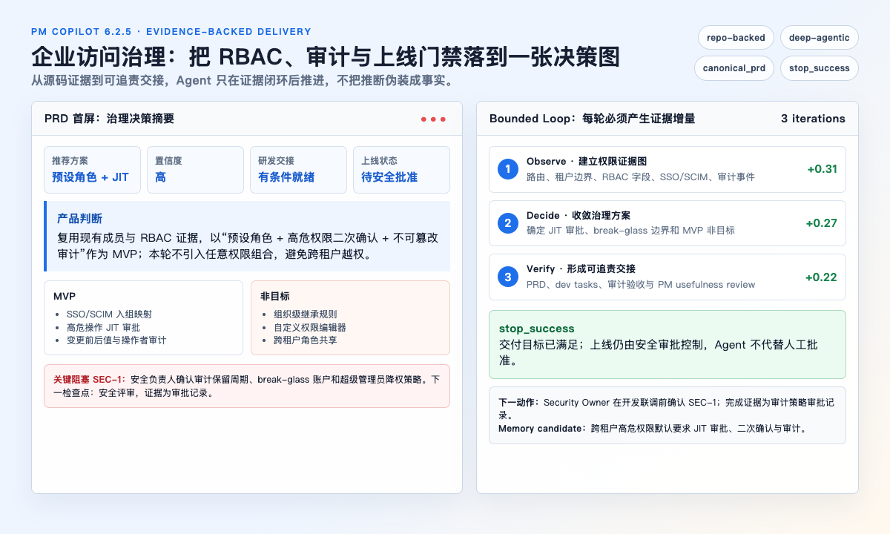
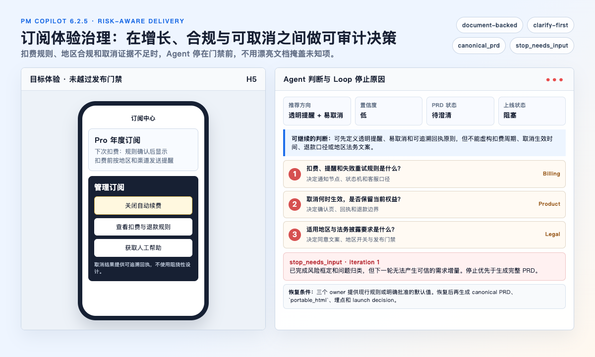

# PM Copilot

<p align="center"><strong>简体中文</strong> | <a href="README.en.md">English</a></p>

<a id="zh-cn"></a>

PM Copilot 是一个开箱即用的 AI 产品经理 Agent 系统。
它把模糊目标、现有代码、产品文档、截图、调研线索或已实现功能，转化为 PM 能直接推进评审、设计、研发、埋点、上线和复盘的交付物。

它不是模板库，也不是只会按 S0-S12 机械流转的流水线。
workflow 是 Agent 的安全执行轨道；用户感知到的是一个会理解目标、主动找证据、做产品判断、产出交付物、验证结果并沉淀记忆候选的 AI PM。

## 它能做什么

- 需求澄清：判断目标、用户、范围、平台、风险和必须先问的问题。
- PRD 交付：生成可评审的 `prd.md`，覆盖背景、目标、调研、需求、埋点、验收、风险和就绪状态。
- PRD HTML：用 `scripts/render_prd_html.py` 生成浏览器可读的 `prd.html`，适合外部交付和同步评审。
- UI 交付：在有源码时优先做 source-backed preview/delta；需要离线交付时用 `extract_ui_region.py` 从源码预览提取；无源码或明确便携 HTML 时生成兼容 `prototype-<platform>.html`。
- 埋点和指标：输出事件、属性、触发时机、隐私说明和验证方式。
- 研发交接：按需生成 `dev-tasks.yaml`，保留依赖、验收、阻塞项和 issue-ready 切片。
- 上线判断：按需生成 `launch-decision.yaml`，区分工程可交接、上线阻塞、owner、回滚和人工批准缺口。
- 已实现功能反向 PRD：读取当前分支 diff、代码、截图/资源和验证结果，把真实实现还原为 `prd.md` + 必需的 `prd.html`。
- 结构化参考：为参数表、能力矩阵、规则说明、数据字典、SOP/runbook 或文档型原型输出 source/review 状态、字段结构、attention points 和交接说明。
- 自我迭代：把真实项目里的失败抽象成可复用规则，更新 Agent、workflow、skills、artifacts、tools、validators 和 eval。

PM Copilot 支持三种上下文模式：`repo-backed`、`document-backed`、`brief-only`。
Agent 会先判断当前证据来源，再选择任务模式和自治等级。

## 语言支持

PM Copilot 将中文和英文都视为一等用户语言。
生成的 PM 产物、UI 交付文案、标注、评审发现、就绪状态和验证说明都应跟随用户语言，并保持同一套交付范围和质量标准。
文件名、事件名、属性名、需求 ID、Mermaid 节点 ID 和其他机器可读标识保持 ASCII，便于跨平台使用。

## 快速开始

直接使用 Agent 时请看 `docs/direct-use.md`。
嵌入到现有项目中使用时请看 `docs/embedded-use.md`。
常见场景看 `docs/use-cases.md`，自治模式看 `docs/agent-modes.md`，交付物价值看 `docs/output-gallery.md`。
从 2.x 升级看 `docs/migration-3.0.md`。

推荐用自然产品目标表达，而不是背内部流程：

```text
我们想优化 H5 会员自动续费体验。用户反馈续费提醒不清楚，取消入口难找，客服工单也在增加。

请先判断缺哪些关键信息；如果信息足够，请输出 PRD、H5 UI 交付物、埋点方案和上线决策建议。
```

如果功能已经在当前分支实现：

```text
当前分支已经把功能写好了。请先读取当前分支 diff、相关代码、截图/资源和验证结果，把实现完整还原成 PRD Markdown，并生成可对外交付的 prd.html。

涉及图片的位置如果没有最终截图，就在对应需求位置放内联 占位图，不要单独做图片列表；如果需求详情是表格，就把图片或占位图填在同一行同一个单元格里，不要放到表格外。
```

缺失截图只在对应需求位置使用下面格式，其他地方不要使用这几个字：

```markdown
> 占位图：资料卡片-加载中.png
> 用途：展示资料卡片加载过程中的骨架屏、按钮状态和错误兜底。
```

如果缺失截图属于需求详情表格中的“图示/截图”行，使用同一单元格写法：

```markdown
| 图示 | 占位图：资料卡片-加载中.png<br>用途：展示资料卡片加载过程中的骨架屏、按钮状态和错误兜底。 |
```

截图按内容命名。
同一个对象有多个状态时使用“对象-具体状态”，例如 `资料卡片-加载中.png`、`资料卡片-加载失败.png`，不要使用 `资料卡片-状态.png`。
截图覆盖粒度按独立页面、窗口、面板或弹窗判断，不要把一个窗口里能同时看见的微状态拆成多张。

## 两个可直接试的 Demo

把下面任一请求直接粘贴给支持 Agent 的工作区。
PM Copilot 会先识别上下文模式、任务模式和自治等级；缺关键信息时先问问题，信息足够后生成交付物并记录验证结果。

### Demo 1：已有项目里的团队权限管理

适合证明 PM Copilot 不只是写通用文档，而是会读取现有代码仓库，贴合当前产品结构、权限模型、路由、UI 组件和埋点约定。



```text
我们要在后台管理端做团队权限管理。

请先检查现有项目里的路由、角色模型、成员管理页面、权限判断、埋点约定和组件风格。
需要做少量外部同类产品参考，但不要把仓库文件当成竞品调研。
如果关键信息不够，请先问我。
如果信息足够，请输出 PRD、Web UI 交付物，并补一份可转 issue 的研发任务拆分。
```

一次有效运行应能产出：

| 产物 | 应该看到什么 |
|---|---|
| `prd.md` | 目标用户、当前产品约束、外部参考结论、MVP/可选/未来范围、成员邀请、角色变更、权限拦截、审计记录、加载/空/错误/无权限状态 |
| Web UI 交付物 | 有前端源码时使用源码驱动的预览路由、Storybook/demo 或 `source_delta_patch`，复用现有后台壳层、组件库和表格密度；需要离线交付时从源码预览区域提取 HTML |
| `dev-tasks.yaml` | 可转 issue 的研发任务、依赖关系、验收标准、测试建议、相关宿主项目文件和阻塞确认项 |
| `run-log.yaml` | `task_mode`、`autonomy_level`、上下文模式、读取文件、外部调研来源、样式证据、工具校验、产品判断、下一步、可追责关键路径和 memory candidates |

### Demo 2：没有代码仓库的会员自动续费优化

适合证明 PM Copilot 可以从一段模糊业务描述或产品文档出发，不依赖代码仓库，也能处理支付、取消、提醒、埋点、隐私和上线门禁这类更高风险的产品需求。



```text
我们想优化 H5 会员自动续费体验。用户反馈续费提醒不清楚，取消入口难找，客服工单也在增加。

业务目标是降低续费相关投诉，同时不要误伤会员留存。
如果需要我补充当前扣费规则、提醒周期、取消路径、客服口径、法务要求或指标口径，请先问我。
信息足够后，请输出 PRD、H5 UI 交付物、埋点方案，并给出上线决策建议。
```

一次有效运行应能产出：

| 产物 | 应该看到什么 |
|---|---|
| `prd.md` | 用户问题、业务目标、外部参考、当前假设、提醒策略、取消链路、支付/客服/法务风险、验收标准和上线状态 |
| `prototype-h5.html` | 无代码或文档起步时的 H5 兼容 HTML UI 交付物，覆盖会员中心入口、续费提醒、自动续费管理、取消确认、结果回执、未登录/无会员/接口失败等访问态和边界状态 |
| PRD 内埋点表 | `renewal_notice_view`、`renewal_manage_open`、`renewal_cancel_submit`、`renewal_cancel_result` 等事件和隐私说明 |
| `launch-decision.yaml` | 工程可交接范围、上线阻塞项、法务/支付/客服 owner、回滚建议和人工批准缺口 |
| `run-log.yaml` | 澄清问题、默认假设、外部调研状态、访问态视觉校验、工具结果和未确认门禁 |

## Agent 运行模型

PM Copilot 3.0 的主循环定义在 `agents/agent-operating-model.md`：

```text
Observe -> Frame -> Decide -> Act -> Verify -> Learn
```

常用任务模式：

| 模式 | 用途 |
|---|---|
| `prd_delivery` | 从目标或上下文生成完整 PRD |
| `implemented_feature_prd` | 从已实现分支还原 PRD 和 HTML |
| `ui_delivery` | 交付源码优先 UI、源码提取 HTML 或兼容 HTML |
| `tracking_plan` | 生成指标和埋点方案 |
| `launch_readiness` | 判断上线阻塞、owner、回滚和批准缺口 |
| `dev_handoff` | 生成研发任务和交接信息 |
| `structured_reference` | 生成结构化参考、规则表、SOP 或文档原型 |
| `product_review` | 审查已有 PRD、UI、实现或上线方案 |
| `self_improvement` | 基于真实失败升级 PM Copilot |
| `mixed_delivery` | 多种任务组合交付 |

自治等级：

- `clarify-first`：默认模式，缺关键信息先问再做。
- `draft-with-risk`：用户要求先出草案时使用，风险和阻塞必须显性化。
- `full-loop`：读取上下文、生成、评审、验证、给下一步。
- `self-iteration`：改进 PM Copilot 自身，需要版本、changelog、eval 和验证。

PM Copilot 还会为复杂任务选择 effort budget，并记录必要的委派计划、恢复检查点和终止条件。
这让长任务可以说明“为什么继续做、为什么停下、哪些 specialist 输出被采纳或拒绝”，而不是只显示流程状态。
从 3.0.1 起，完整交付还会把推荐方案转成 `action_closure`：每个关键动作都要有 owner、截止阶段、来源决策或阻塞项、完成证据和状态，避免只留下“后续对齐”式建议。

## 在现有项目中使用

推荐结构：

```text
host-repo/
|-- AGENTS.md or CLAUDE.md or .cursor/rules/
|-- src/
`-- pm-copilot/
    `-- PM_COPILOT.md
```

将本仓库复制或 clone 到宿主项目的 `pm-copilot/` 目录，然后在宿主仓库根目录安装适配器：

```bash
cd host-repo/pm-copilot
python3 scripts/install_adapter.py --host .. --tool all
```

嵌入式使用时适配器是必要的。
仅把 `pm-copilot/` 文件夹放入另一个项目，并不能保证 Codex、Claude Code、Cursor 或其他 Agent 自动发现嵌套说明。
如果用户在宿主仓库里写 `@pm-copilot`，适配器应将它解析为本地 `pm-copilot/PM_COPILOT.md`，而不是外部工具调用。

## 仓库结构

```text
PM_COPILOT.md  跨平台 Agent front door
agents/        Agent 职责、接口和 operating model
workflow/      执行图、上下文加载、交付检查和交接流程
artifacts/     PRD、UI、trace、结构化参考、工具结果和交接契约
skills/        可复用产品方法能力
tools/         工具注册表、使用协议和验证说明
prompts/       提示词组装、记忆、澄清和生成规则
context/       产品记忆、用户偏好、决策和示例上下文
guardrails/    安全、隐私、来源、假设和故障转移规则
templates/     产物和 run-log 模板
docs/          用户、维护者、案例、模式和迁移文档
scripts/       本地校验、渲染、提取、安装和评分脚本
adapters/      Codex、Claude Code、Cursor 等宿主项目适配器
```

## 验证和工具

常用本地命令：

```bash
python3 scripts/preflight_tools.py
python3 scripts/validate_outputs.py outputs/<run-id>
python3 scripts/run_delivery_checks.py outputs/<run-id> --language zh
python3 scripts/validate_agent_trace.py outputs/<run-id> --strict
python3 scripts/analyze_agent_run_evidence.py --json
python3 scripts/setup_visual_validation.py
python3 scripts/validate_prototype_visual.py outputs/<run-id>
python3 scripts/validate_ui_preview.py <preview-url-or-file> --run-folder outputs/<run-id>
python3 scripts/render_prd_html.py outputs/<run-id>
python3 scripts/agent_improvement_scorecard.py
python3 scripts/validate_repo.py
```

`tools/tool-registry.yaml` 是工具能力源。
工具结果应尽量符合 `artifacts/tool-result-contract.md`。
生成兼容 HTML UI 交付物时使用 `validate_prototype_visual.py`；源码驱动预览使用宿主项目预览路径，并在有 URL 或文件时使用 `validate_ui_preview.py`。

## 记忆

PM Copilot 使用本地文件记忆，让重复使用更贴合产品和个人工作方式：

- `context/product-memory.local.yaml` 存放稳定产品事实
- `context/user-preferences.local.yaml` 存放用户工作风格
- `context/decision-log.local.yaml` 存放长期产品决策
- `outputs/<run-id>/run-log.yaml` 存放单次运行追踪

仓库只提供 `.example.yaml` schema。
`.local.yaml` 记忆文件会被 Git 忽略，应保持私有。
当前用户指令和当前产品上下文始终优先于记忆。

## 平台中立

PM Copilot 不绑定特定 Agent 框架。
它由可移植 Markdown 契约、脚本和模板组成，可以适配 Codex、Claude Code、Cursor 或内部 Agent 平台。
Agent 定义职责，skills 提供方法，workflow 提供执行图，artifacts 定义验收，tools 提供验证，guardrails 限制高风险行为。

## 维护者入口

- `docs/release-checklist.md`：发版检查
- `docs/optimization-playbook.md`：系统改进方法
- `docs/self-improvement-system.md`：自我迭代系统
- `docs/practice-self-iteration.md`：真实项目反馈如何进入通用能力
- `docs/versioning.md`：版本策略
