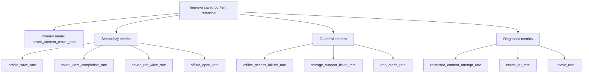

# Metrics Tree

## Product Goal

Increase return reading and content completion by helping users save content for later.

## KPI Tree

## Metric Definitions

| Metric | Definition | Type | Window |
|---|---|---|---|
| saved_content_return_rate | Users opening saved content / users saving content | Primary | 7 days |
| article_save_rate | Article saves / article detail views | Secondary | Daily |
| saved_item_completion_rate | Completed saved articles / opened saved articles | Secondary | 7 days |
| saved_tab_view_rate | Saved tab views / active app users | Secondary | Daily |
| offline_open_rate | Offline article opens / saved article opens | Secondary | 7 days |
| offline_access_failure_rate | Offline access failures / offline open attempts | Guardrail | Daily |
| storage_support_ticket_rate | Storage-related support tickets / active app users | Guardrail | Weekly |
| app_crash_rate | Crashes / sessions involving saved or offline content | Guardrail | Daily |
| restricted_content_attempt_rate | Restricted offline attempts / offline attempts | Diagnostic | Daily |
| cache_hit_rate | Cached opens / offline open attempts | Diagnostic | Daily |
| unsave_rate | Unsave events / saved articles | Diagnostic | 7 days |

## Measurement Assumptions

- Content IDs are safe to log under current analytics policy.
- App can detect network status and cache status.
- Completion definition is available from the existing reader analytics system.
