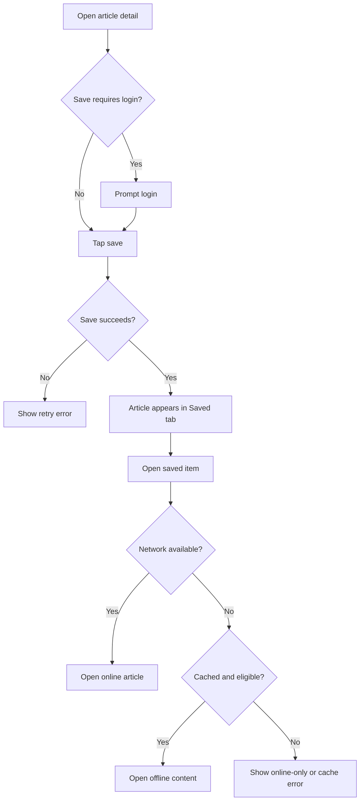

# Content Save and Offline Reading PRD

## Version History

| Version | Date | Author | Change |
|---|---|---|---|
| v0.1 | 2026-05-18 | PM Copilot | Initial PRD/prototype delivery example |

## Requirement Input and Confirmation Record

| Item | Status | Record |
|---|---|---|
| Original request | Confirmed | Users often lose articles they want to read later; add a save feature and maybe offline reading in the mobile app. |
| Target platform | Confirmed | Native mobile App. |
| Business goal | Confirmed | Increase return visits and content completion by helping users save content for later. |
| Offline scope | Draft assumption | Offline reading is included only for eligible saved content where rights and storage allow. |
| Premium policy | Open | Whether offline access is premium-only is not confirmed. |

## Readiness

| Field | Status | Notes |
|---|---|---|
| PRD status | Ready for review | Consolidated PRD includes requirements, flow, tracking, risks, and validation notes. |
| Engineering handoff status | Draft with confirmation risk | Offline eligibility, cache limit, and sync model need confirmation. |
| Launch status | Draft | Rights review and storage-limit copy must be approved before launch. |

## Background

Readers discover content throughout the day but may not have time or stable network to finish it. A simple save path helps users return later, while limited offline support can improve reading continuity when content rights and device storage allow.

## Research and Reference Findings

| Source Type | Finding | Product Impact |
|---|---|---|
| Product context | The request targets an existing App content consumption flow. | Prototype should adapt article detail and saved-list surfaces. |
| Rights reference | Some content may not be eligible for offline access. | Offline state must show eligibility and restriction reasons. |
| Technical reference | Offline storage is limited by device capacity and app cache policy. | PRD must define cache limits, failure states, and clear recovery. |
| Analytics reference | Existing taxonomy is not provided. | Events are proposed and require analytics/engineering approval. |

## Project Goals and Metrics

| Goal | Metric | Target | Type |
|---|---|---|---|
| Increase return reading | Saved content return rate | TBD | Primary |
| Improve completion | Completion rate for saved items | TBD | Secondary |
| Encourage useful saving | Save action rate, Saved tab view rate | Directional increase | Diagnostic |
| Avoid negative impact | Offline failure rate, storage support rate, crash rate | No material increase | Guardrail |

## Scope

| Scope Type | Items |
|---|---|
| Confirmed MVP | Save/unsave from article detail, Saved tab list, online saved reading, restricted-content state, error states, proposed analytics. |
| Optional or conditional | Offline opening for eligible cached content, if rights and cache policy are confirmed. |
| Future scope | Collections, folders, advanced sorting, full download manager, cross-device conflict resolution. |
| Non-goals | Full library redesign, offline access for restricted content, background bulk download. |

## Requirement List

| ID | Requirement | Priority | Notes |
|---|---|---|---|
| R1 | Users can save or unsave an article from article detail. | Must | App top action. |
| R2 | Saved articles appear in a Saved tab. | Must | Native app navigation. |
| R3 | Eligible saved articles can be opened offline after caching. | Should | Conditional on rights and storage. |
| R4 | Restricted content explains why offline access is unavailable. | Must | Avoid silent failure. |
| R5 | Storage or network failures show recoverable error states. | Must | Include retry where possible. |
| R6 | Track save, unsave, saved tab view, offline open, and failure events. | Must | See Tracking Plan in this PRD. |

## Requirement Details

| ID | Function | Scenario | Entry/Trigger | Content Requirements | Business Logic | Interaction Rules | Data Rules | Permissions | Edge States | Tracking | Acceptance |
|---|---|---|---|---|---|---|---|---|---|---|---|
| R1 | Save/unsave action | Reader saves article for later | Article detail action tap | Save icon state, toast, optional login prompt | Save one article per user/content pair | Toggle must be reversible and optimistic only if rollback is reliable | Store content ID and user ID, not article body in analytics | Login required if product requires account save | Save API fails, article removed | `content_saved`,`content_unsaved` | AC1 |
| R2 | Saved tab | Reader returns to saved content | Bottom tab or profile entry | Saved list, title, thumbnail, saved time, eligibility state | Sort by latest saved by default | Empty state has return-to-read CTA | List uses saved-content API | Logged-in user | Empty list, network error | `saved_tab_viewed` | AC2 |
| R3 | Offline open | Reader opens eligible cached item without network | Tap saved item offline | Cached article content, cache freshness note | Only eligible content can be cached and opened offline | Offline badge and fallback to online when needed | Cache respects size and expiry policy | Logged-in user, rights eligible | Cache missing, stale content | `offline_content_opened` | AC3 |
| R4 | Restricted state | Saved item is not eligible for offline | Eligibility check | Clear online-only reason | Restricted items remain saveable if online reading is allowed | Do not show download affordance | Eligibility from rights service | User entitlement varies | Premium-only, rights expired | `offline_restricted_viewed` | AC4 |
| R5 | Recoverable errors | Save/cache/open fails | API, network, or storage error | Error reason, retry or settings guidance | Preserve previous valid state | Retry only for recoverable errors | Error category only | App user | Storage full, network unavailable | `content_save_failed`,`offline_open_failed` | AC5 |

## Flow Diagram

## Tracking Plan

Analytics taxonomy source: proposed taxonomy; no existing app event naming convention is provided in the scenario.

| event_name | Description | Trigger | Platform | Actor | required_properties | optional_properties | Success Criteria | Validation Notes | Privacy Notes |
|---|---|---|---|---|---|---|---|---|---|
| `content_saved` | User saves an article | Save succeeds | App | reader | `content_id`,`content_type`,`entry` | `offline_eligible` | Save rate calculable | Compare event with save API success | Content ID follows internal policy |
| `content_unsaved` | User removes saved state | Unsave succeeds | App | reader | `content_id`,`content_type`,`entry` | `saved_duration_bucket` | Unsave rate calculable | Toggle test | No article body in event |
| `saved_tab_viewed` | User views Saved tab | Tab render | App | reader | `saved_count_bucket` | `network_state` | Return usage visible | Route/tab test | Count bucket only |
| `offline_content_opened` | User opens cached eligible content offline | Offline article render | App | reader | `content_id`,`content_type`,`cache_age_bucket` | `network_state` | Offline usage measurable | Device offline test | No full content payload |
| `offline_restricted_viewed` | User sees offline restriction | Restricted state render | App | reader | `restriction_reason`,`content_type` | `membership_state` | Restriction impact visible | Rights fixture test | Reason category only |
| `content_save_failed` | Save or unsave fails | API/client error | App | reader | `error_category`,`entry` | `content_type` | Failure rate visible | API failure test | Error category only |
| `offline_open_failed` | Offline open fails | Cache/open error | App | reader | `error_category`,`cache_state` | `content_type` | Offline reliability visible | Storage/network fixture | Error category only |

| property_name | Type | Required | Example | Description | Allowed Values | Privacy Level | Source |
|---|---|---|---|---|---|---|---|
| `content_id` | string | Conditional | `article_123` | Content identifier | Existing IDs | Internal | Content service |
| `content_type` | string | Yes | `article` | Content format | `article`,`video`,`audio` | Public category | Content service |
| `entry` | string | Yes | `article_detail` | User entry surface | `article_detail`,`saved_tab`,`profile` | Internal | Client route |
| `offline_eligible` | boolean | Conditional | `true` | Whether content can be cached | `true`,`false` | Internal | Rights service |
| `restriction_reason` | string | Conditional | `rights_restricted` | Offline restriction reason | Approved categories | Internal | Rights service |
| `error_category` | string | Conditional | `storage_full` | Safe error bucket | Approved categories | Internal | Client/API |

## Prototype Reference

Prototype file: `prototype-app.html`

The prototype should show article detail save state, Saved tab, offline eligibility states, storage/network errors, and page-level numbered annotations for product logic and interaction notes.

## Risks and Open Confirmations

| Item | Severity | Required Before | Owner | Status |
|---|---|---|---|---|
| Offline rights eligibility | High | Engineering handoff | Product, Legal, Engineering | Open |
| Cache size and expiry policy | High | Engineering handoff | Engineering | Open |
| Premium-only offline access | Medium | Scope decision | Product | Open |
| Cross-device sync for saved list | Medium | Scope decision | Product, Engineering | Excluded from MVP until confirmed |
| Storage and rights copy | Medium | Launch | Product, Legal | Open |

## Acceptance Criteria

| ID | Criteria | Verification |
|---|---|---|
| AC1 | Save state toggles correctly and recovers from failed requests. | QA app test |
| AC2 | Saved tab lists saved articles and handles empty/error states. | QA with seeded content |
| AC3 | Eligible cached article opens without network when offline scope is enabled. | Offline device test |
| AC4 | Restricted article shows online-only state and does not expose a download action. | Rights scenario test |
| AC5 | Storage, network, and save failures show clear recovery. | Failure-state QA |
| AC6 | Required analytics events fire with approved properties. | Analytics validation |

## Delivery Review Findings

| Severity | Artifact | Finding | Evidence | Owner | Required Before | Status |
|---|---|---|---|---|---|---|
| High | PRD | Offline eligibility must be confirmed before engineering-ready handoff. | Risks list rights eligibility and cache policy as open. | Product, Legal, Engineering | Engineering handoff | Open |
| Medium | PRD | Event taxonomy is proposed, not approved. | Tracking Plan states no existing taxonomy source was provided. | Analytics | Engineering handoff | Open |
| Low | Prototype | Prototype is suitable for review but not production code. | Prototype reference is paired with HTML artifact only. | Design, Engineering | Implementation | Noted |

## Validation Results

| Check | Result | Notes |
|---|---|---|
| PRD structure | Passed | Default delivery is consolidated into this PRD. |
| Prototype reference | Passed | `prototype-app.html` exists as the paired artifact. |
| Rights review | Pending | Offline eligibility must be approved. |
| Analytics review | Pending | Event taxonomy is proposed until approved. |
