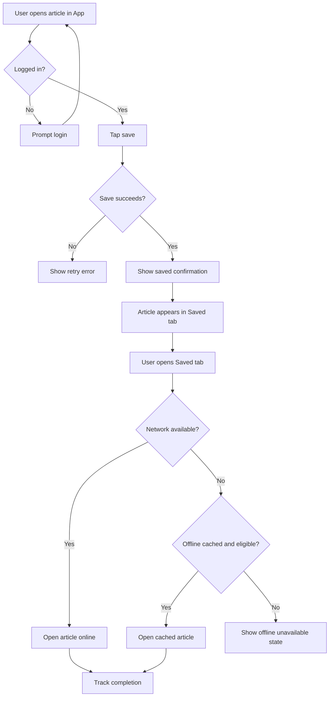

# User Flow

## Legend

| Shape | Meaning |
|---|---|
| Rectangle | App screen, state, or action |
| Diamond | Login, persistence, network, or cache decision |

## Notes

- Offline unavailable states should explain why the content cannot open.
- Login returns the user to the original article after completion.
