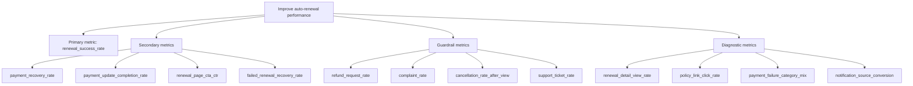

# Metrics Tree

## Product Goal

Improve successful membership auto-renewal while preserving user trust and billing transparency.

## KPI Tree

## Metric Definitions

| Metric | Definition | Type | Window |
|---|---|---|---|
| renewal_success_rate | Eligible members with successful renewal / eligible members entering renewal window | Primary | Renewal cycle |
| payment_recovery_rate | Failed or risky renewals recovered / failed or risky renewals exposed to recovery flow | Secondary | 7 days |
| payment_update_completion_rate | Successful payment updates / payment update starts | Secondary | Session and 7 days |
| renewal_page_cta_ctr | Primary CTA clicks / renewal page views | Secondary | Session |
| failed_renewal_recovery_rate | Successful renewals after failed attempt / failed renewal users entering flow | Secondary | 7 days |
| refund_request_rate | Refund requests / successful renewals | Guardrail | 14 days |
| complaint_rate | Billing-related complaints / renewal page viewers | Guardrail | 14 days |
| cancellation_rate_after_view | Auto-renewal cancellations / renewal page viewers | Guardrail | 7 days |
| support_ticket_rate | Support tickets related to renewal / renewal page viewers | Guardrail | 14 days |
| renewal_detail_view_rate | Renewal detail page views / eligible notified users | Diagnostic | Campaign |
| policy_link_click_rate | Policy link clicks / renewal page views | Diagnostic | Session |

## Measurement Assumptions

- Eligibility and renewal result are calculated server-side.
- Payment failure reason is stored as a non-sensitive category.
- Complaint and refund data can be joined at aggregated user or account level according to privacy rules.
- Experiment exposure is available if copy or layout variants are tested.
