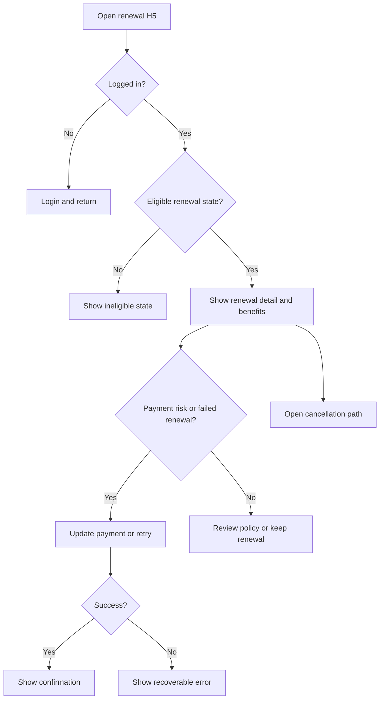

# Membership Auto-Renewal Optimization PRD

## Version History

| Version | Date | Author | Change |
|---|---|---|---|
| v0.1 | 2026-05-18 | PM Copilot | Initial PRD/prototype delivery example |

## Requirement Input and Confirmation Record

| Item | Status | Record |
|---|---|---|
| Original request | Confirmed | Optimize membership auto-renewal because renewal conversion is lower than expected. |
| Target platform | Confirmed | H5 first, entered from mobile web push, in-app message, SMS, or email links. |
| Business goal | Confirmed | Improve successful renewal without increasing complaints, refunds, or accidental-renewal perception. |
| Launch copy | Must confirm before launch | Payment, cancellation, consent, and refund copy require legal review. |
| Baseline and target | Open | Renewal baseline and expected lift are not provided. |

## Readiness

| Field | Status | Notes |
|---|---|---|
| PRD status | Ready for review | Scope, flows, tracking, prototype reference, and validation notes are included. |
| Engineering handoff status | Draft with confirmation risk | Payment failure categories and processor capabilities must be confirmed before implementation sizing. |
| Launch status | Blocked | Legal-approved copy, reminder frequency, and baseline metric target are still open. |

## Background

Membership auto-renewal protects recurring revenue and reduces user effort, but renewal success can drop when users do not understand the renewal value, payment methods fail, or billing details are unclear. The first H5 release should make the renewal decision transparent, recover payment issues, and preserve user trust.

## Research and Reference Findings

| Source Type | Finding | Product Impact |
|---|---|---|
| Product context | Membership users may enter from reminders or membership center links. | The page must work as a standalone H5 landing page and preserve safe source parameters. |
| Compliance reference | Billing, cancellation, refund, and consent copy require human review. | The framework can be designed before launch copy is final, but launch remains blocked. |
| Technical reference | Payment recovery requires secure update and retry flows. | The PRD must avoid raw card data and use non-sensitive failure categories. |
| Analytics reference | Existing taxonomy is not provided. | Events are proposed and require analytics/engineering approval. |

## Project Goals and Metrics

| Goal | Metric | Target | Type |
|---|---|---|---|
| Improve successful renewal | Renewal success rate among eligible members | TBD after baseline | Primary |
| Recover preventable failures | Payment recovery rate | TBD after baseline | Secondary |
| Preserve trust | Complaint rate, refund request rate, cancellation rate | No material increase | Guardrail |
| Improve clarity | Renewal detail view rate, policy link click rate | Directional increase | Diagnostic |

## Scope

| Scope Type | Items |
|---|---|
| Confirmed MVP | H5 renewal detail page, benefit recap, payment-risk warning, payment recovery entry, policy/cancellation links, success and ineligible states, proposed analytics events. |
| Optional or conditional | A/B test of benefit recap and reminder copy, if experiment framework is available. |
| Future scope | Native App and Mini Program renewal expansion. |
| Non-goals | Pricing redesign, new membership tiers, hiding cancellation, aggressive retention patterns, raw payment data collection. |

## Requirement List

| ID | Requirement | Priority | Notes |
|---|---|---|---|
| R1 | Show renewal date, plan, renewal price, billing cycle, and payment status. | Must | Copy requires legal review. |
| R2 | Show a concise benefit recap tied to current membership value. | Must | Avoid exaggerated claims. |
| R3 | Show payment-risk warning and update-payment CTA when method is invalid or expiring. | Must | Do not display raw payment details. |
| R4 | Show failed-renewal recovery state with retry and update options. | Must | Failure reason category must be non-sensitive. |
| R5 | Keep cancellation, renewal terms, and refund policy visible. | Must | Must not be hidden below misleading CTAs. |
| R6 | Show confirmation after payment update or successful renewal recovery. | Must | Include next renewal date when available. |
| R7 | Track page views, CTA clicks, payment update, recovery, policy link, and error events. | Must | See Tracking Plan in this PRD. |
| R8 | Support ineligible states for login, expired window, unsupported method, and completed renewal. | Should | Prevent dead ends. |

## Requirement Details

| ID | Function | Scenario | Entry/Trigger | Content Requirements | Business Logic | Interaction Rules | Data Rules | Permissions | Edge States | Tracking | Acceptance |
|---|---|---|---|---|---|---|---|---|---|---|---|
| R1 | Renewal detail summary | Eligible member opens H5 page | Reminder link or membership center | Plan, billing cycle, renewal price, renewal date, masked payment type, status | Show only if active membership and renewal data exist | Billing facts stay above benefit content | Do not expose full payment credentials | Logged-in member only | Missing plan, missing price, already renewed | `renewal_detail_viewed` | AC1 |
| R2 | Benefit recap | User evaluates renewal value | Page load | 3-5 current benefits and expiry impact | Use current plan benefits only | Compact recap; no blocking modal | No inferred benefit claims | Logged-in member only | Benefit data unavailable | `renewal_benefit_recap_viewed` | AC2 |
| R3 | Payment-risk warning | Payment method is expiring or invalid | Payment status response | Warning, masked method type, update CTA | Trigger from approved risk status only | Primary CTA opens secure update flow | Store no raw card data | Logged-in member with payment method | Update unavailable, processor downtime | `payment_update_clicked` | AC3 |
| R4 | Failed-renewal recovery | Latest renewal attempt failed | Failed attempt status | Non-sensitive reason category, retry/update CTA, support link | Allow retry only inside recovery window | Keep form state after recoverable error | Use category codes, not processor raw error | Logged-in member | Window expired, retry fails | `renewal_recovery_started`, `renewal_recovery_succeeded` | AC4 |
| R5 | Policy and cancellation access | User reviews terms or cancellation | Visible footer and secondary link | Cancellation, renewal terms, refund policy | Links must be available from page entry | Do not visually hide below dark-pattern copy | Source URL from legal/product config | Logged-in member or public policy path | Legal copy unavailable | `renewal_policy_clicked` | AC5 |
| R6 | Confirmation state | Payment update or recovery succeeds | Processor success callback | Success message, next renewal date, membership status | Refresh membership status before display | Provide return to membership center | Store only transaction status reference | Logged-in member | Status refresh fails | `renewal_confirmation_viewed` | AC6 |
| R8 | Ineligible states | User cannot use renewal flow | Login, eligibility, or renewal status check | Reason and next best action | Match state to eligibility code | One clear recovery CTA | No sensitive reason leakage | Varies by state | Not logged in, unsupported method, expired window | `renewal_ineligible_viewed` | AC8 |

## Flow Diagram

## Tracking Plan

Analytics taxonomy source: proposed taxonomy; no existing event naming convention is provided in the scenario.

| event_name | Description | Trigger | Platform | Actor | required_properties | optional_properties | Success Criteria | Validation Notes | Privacy Notes |
|---|---|---|---|---|---|---|---|---|---|
| `renewal_detail_viewed` | Renewal page is viewed | Page data renders | H5 | member | `plan_id`,`renewal_state`,`source` | `campaign_id` | Event fires once per page view | Compare client event with page render log | No raw payment data |
| `payment_update_clicked` | User clicks update payment | Update CTA click | H5 | member | `renewal_state`,`payment_status`,`source` | `campaign_id` | CTA clicks are measurable | Verify with UI click test | Payment status is category only |
| `renewal_recovery_started` | User starts retry or payment recovery | Retry/update flow opens | H5 | member | `recovery_type`,`failure_category` | `campaign_id` | Recovery funnel starts | Verify processor sandbox path | Failure category must be non-sensitive |
| `renewal_recovery_succeeded` | Recovery succeeds | Processor success callback confirmed | H5 | member | `recovery_type`,`renewal_state` | `campaign_id` | Success rate can be calculated | Reconcile with subscription service | No transaction secrets |
| `renewal_policy_clicked` | User opens policy/cancellation/terms | Policy link click | H5 | member | `policy_type`,`source` | `campaign_id` | Policy access is measurable | Verify each link | No personal data |
| `renewal_ineligible_viewed` | User sees ineligible state | Eligibility check fails | H5 | member | `ineligible_reason`,`source` | `campaign_id` | Dead-end states visible in analytics | Test state fixtures | Reason must not expose sensitive details |

| property_name | Type | Required | Example | Description | Allowed Values | Privacy Level | Source |
|---|---|---|---|---|---|---|---|
| `plan_id` | string | Yes | `gold_monthly` | Membership plan identifier | Existing plan IDs | Internal | Subscription service |
| `renewal_state` | string | Yes | `upcoming` | Current renewal state | `upcoming`,`risk`,`failed`,`recovered`,`ineligible` | Internal | Subscription service |
| `source` | string | Yes | `sms` | Entry source | `membership_center`,`push`,`in_app`,`sms`,`email` | Internal | Link parameter |
| `payment_status` | string | Yes | `expiring` | Payment method state category | `normal`,`expiring`,`invalid`,`failed` | Sensitive category | Payment service |
| `failure_category` | string | Conditional | `insufficient_funds` | Non-sensitive payment failure bucket | Approved category list | Sensitive category | Payment service |
| `policy_type` | string | Conditional | `refund` | Policy link type | `renewal_terms`,`refund`,`cancellation` | Public | Product config |

## Prototype Reference

Prototype file: `prototype-h5.html`

The prototype should show the H5 renewal page, payment-risk and failed-renewal branches, visible policy/cancellation entry, confirmation state, and numbered annotations for product logic and interaction notes.

## Risks and Open Confirmations

| Item | Severity | Required Before | Owner | Status |
|---|---|---|---|---|
| Legal-approved billing, renewal, cancellation, and refund copy | High | Launch | Legal, Product | Open |
| Payment failure category list and retry capability | High | Engineering handoff | Engineering | Open |
| Baseline renewal success rate and target lift | Medium | Launch | Product, Analytics | Open |
| Reminder frequency and channel approval | Medium | Launch | Product, Operations | Open |
| Discount inclusion | Medium | Scope decision | Product | Excluded from MVP until confirmed |

## Acceptance Criteria

| ID | Criteria | Verification |
|---|---|---|
| AC1 | Eligible users can see plan, price, cycle, renewal date, and payment status. | QA account-state fixtures |
| AC2 | Benefit recap appears without hiding billing details or policy links. | Product/design review |
| AC3 | Payment-risk users can open secure update flow without raw payment details. | Payment sandbox test |
| AC4 | Failed-renewal users can retry or update payment inside recovery window. | Processor failure simulation |
| AC5 | Cancellation and policy links remain visible from the renewal page. | Legal and QA review |
| AC6 | Success state shows refreshed membership status and next renewal date when available. | QA happy path |
| AC7 | Required analytics events fire with approved properties. | Analytics validation |
| AC8 | Ineligible states provide clear next actions. | QA state matrix |

## Delivery Review Findings

| Severity | Artifact | Finding | Evidence | Owner | Required Before | Status |
|---|---|---|---|---|---|---|
| High | PRD | Launch copy is not approved. | Legal copy is listed as open in risks. | Legal, Product | Launch | Open |
| Medium | PRD | Event taxonomy is proposed, not approved. | Tracking Plan states no existing taxonomy source was provided. | Analytics | Engineering handoff | Open |
| Low | Prototype | Prototype is suitable for review but not production code. | Prototype reference is paired with HTML artifact only. | Design, Engineering | Implementation | Noted |

## Validation Results

| Check | Result | Notes |
|---|---|---|
| PRD structure | Passed | Default delivery is consolidated into this PRD. |
| Prototype reference | Passed | `prototype-h5.html` exists as the paired artifact. |
| Analytics review | Pending | Event taxonomy is proposed until approved. |
| Legal launch review | Pending | Copy and policy details require owner approval. |
