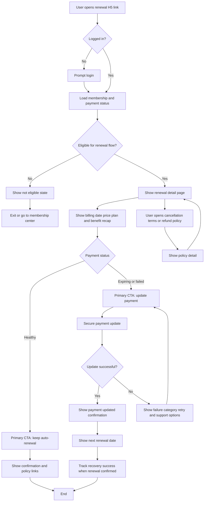

# User Flow

## Legend

| Shape | Meaning |
|---|---|
| Rectangle | H5 page, module, or state |
| Diamond | Login, eligibility, payment, or callback decision |

## Notes

- Payment update must happen through a secure payment handoff.
- Cancellation, terms, and refund policy links remain visible.
