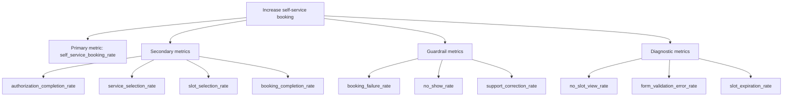

# Metrics Tree

## Product Goal

Reduce manual support booking by enabling users to complete appointment reservations inside the mini program.

## KPI Tree

## Metric Definitions

| Metric | Definition | Type | Window |
|---|---|---|---|
| self_service_booking_rate | Completed mini-program bookings / total bookings | Primary | Weekly |
| authorization_completion_rate | Authorization completions / authorization requests | Secondary | Session |
| service_selection_rate | Service selections / booking entry views | Secondary | Session |
| slot_selection_rate | Slot selections / service selections | Secondary | Session |
| booking_completion_rate | Successful bookings / form submissions | Secondary | Session |
| booking_failure_rate | Failed bookings / form submissions | Guardrail | Daily |
| no_show_rate | No-shows / confirmed bookings | Guardrail | Weekly |
| support_correction_rate | Support-corrected bookings / confirmed bookings | Guardrail | Weekly |
| no_slot_view_rate | No-slot states / date views | Diagnostic | Daily |
| form_validation_error_rate | Validation errors / form submissions | Diagnostic | Session |
| slot_expiration_rate | Expired slot failures / form submissions | Diagnostic | Daily |

## Measurement Assumptions

- Operations can distinguish self-service bookings from support-created bookings.
- Booking IDs are approved for analytics use.
- No-show and support correction data are available after appointment time.
