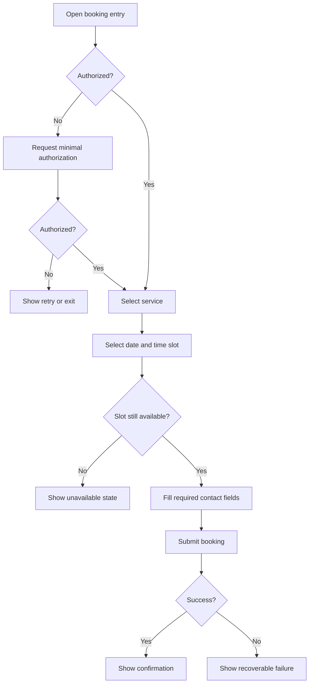

# Mini Program Appointment Booking PRD

## Version History

| Version | Date | Author | Change |
|---|---|---|---|
| v0.1 | 2026-05-18 | PM Copilot | Initial PRD/prototype delivery example |

## Requirement Input and Confirmation Record

| Item | Status | Record |
|---|---|---|
| Original request | Confirmed | Users should book service appointments from the mini program instead of messaging support manually. |
| Target platform | Confirmed | Mini Program. |
| Business goal | Confirmed | Reduce manual support booking and let users complete appointment reservation in product. |
| Payment | Confirmed out of scope | Payment is not included in v1. |
| Slot hold and reschedule rules | Open | Slot hold duration, cancellation, and reschedule behavior are not confirmed. |

## Readiness

| Field | Status | Notes |
|---|---|---|
| PRD status | Ready for review | Consolidated PRD includes requirements, flow, tracking, risks, and validation notes. |
| Engineering handoff status | Draft with confirmation risk | Authorization fields, slot hold, and booking API behavior must be confirmed. |
| Launch status | Draft | Operations process and support fallback must be approved before launch. |

## Background

Users currently rely on support messages to reserve service appointments. This creates manual work, delayed confirmation, and inconsistent booking records. A mini-program booking flow should support authorization, service selection, time-slot selection, minimal contact fields, and confirmation.

## Research and Reference Findings

| Source Type | Finding | Product Impact |
|---|---|---|
| Product context | The request targets a mini-program service booking flow. | Prototype should follow compact mobile mini-program interaction patterns. |
| Operations reference | Slot availability comes from operations inventory. | Slot selection must revalidate inventory on submit. |
| Privacy reference | Contact fields must be minimized. | Only required fields should be collected and tracked as categories. |
| Analytics reference | Existing taxonomy is not provided. | Events are proposed and require analytics/engineering approval. |

## Project Goals and Metrics

| Goal | Metric | Target | Type |
|---|---|---|---|
| Reduce manual booking | Self-service booking rate | TBD | Primary |
| Improve booking completion | Booking completion rate | TBD | Secondary |
| Understand funnel drop-off | Authorization completion rate, slot selection rate, form completion rate | Directional improvement | Diagnostic |
| Protect operations quality | No-show rate, support correction rate, booking failure rate | No material increase | Guardrail |

## Scope

| Scope Type | Items |
|---|---|
| Confirmed MVP | Authorization, service selection, available date/slot selection, minimal contact form, booking confirmation, unavailable/expired slot states, proposed tracking. |
| Optional or conditional | Notify when no slots are available, if operations can support follow-up. |
| Future scope | Payment, staff scheduling optimization, cancellation/reschedule self-service, calendar integration, loyalty/coupon integration. |
| Non-goals | Full account redesign, full operations scheduling system, multi-service bundle checkout. |

## Requirement List

| ID | Requirement | Priority | Notes |
|---|---|---|---|
| R1 | Users can authorize before booking with minimal required permission. | Must | Authorization fields need confirmation. |
| R2 | Users can select one service type. | Must | Service list comes from operations config. |
| R3 | Users can select available date and time slot. | Must | Hide or disable unavailable slots. |
| R4 | Users can submit required contact information. | Must | Minimize personal data. |
| R5 | Users see confirmation after successful booking. | Must | Include service, time, location, and support contact. |
| R6 | Unavailable, expired, or failed slots show clear recovery. | Must | Prevent dead ends. |
| R7 | Track authorization, service selection, slot selection, form submit, success, and failure events. | Must | See Tracking Plan in this PRD. |

## Requirement Details

| ID | Function | Scenario | Entry/Trigger | Content Requirements | Business Logic | Interaction Rules | Data Rules | Permissions | Edge States | Tracking | Acceptance |
|---|---|---|---|---|---|---|---|---|---|---|---|
| R1 | Authorization | First-time user starts booking | Book CTA tap | Authorization reason and minimal requested fields | Request only fields required for booking | Allow deny, retry, or exit | Store consent status and approved profile fields only | Mini-program authorization | Denied, expired session | `booking_authorization_started`,`booking_authorization_completed` | AC1 |
| R2 | Service selection | User chooses service | Service list page | Service name, duration, location note, availability hint | Only active services are selectable | One service selected in v1 | Service ID from operations config | Authorized user | Service disabled, no services | `booking_service_selected` | AC2 |
| R3 | Date and slot selection | User picks appointment time | Service selected | Available dates, time slots, disabled state reason | Revalidate slot availability on selection and submit | Disable unavailable slots; show loading state | Slot ID and date from inventory API | Authorized user | Slot full, stale inventory | `booking_slot_selected` | AC3 |
| R4 | Contact form | User provides required info | Slot selected | Required fields, privacy note, inline validation | Submit only when required fields pass validation | Preserve form after recoverable error | Collect minimum contact fields | Authorized user | Invalid phone, missing name | `booking_form_submitted` | AC4 |
| R5 | Confirmation | Booking succeeds | Booking API success | Service, time, location, booking ID, support contact | Confirmation uses persisted booking record | Provide return/home action | Booking ID is internal identifier | Authorized user | Confirmation refresh fails | `booking_succeeded` | AC5 |
| R6 | Failure and unavailable states | Booking cannot continue | API or inventory error | Reason and next available action | Expired slot returns to slot selection | Keep user selections where safe | Error category only | Authorized user | API failure, no slots | `booking_failed`,`booking_no_slot_viewed` | AC6 |

## Flow Diagram

## Tracking Plan

Analytics taxonomy source: proposed taxonomy; no existing mini-program event naming convention is provided in the scenario.

| event_name | Description | Trigger | Platform | Actor | required_properties | optional_properties | Success Criteria | Validation Notes | Privacy Notes |
|---|---|---|---|---|---|---|---|---|---|
| `booking_authorization_started` | User starts authorization | Authorization prompt opens | Mini Program | user | `entry`,`authorization_scope` | `service_id` | Auth funnel starts | Mini-program auth test | Scope only, no raw profile |
| `booking_authorization_completed` | Authorization result is returned | Auth success/fail | Mini Program | user | `authorization_result`,`authorization_scope` | `entry` | Auth completion measurable | Allow/deny test | Result category only |
| `booking_service_selected` | User selects service | Service tap | Mini Program | user | `service_id`,`entry` | `availability_state` | Service funnel measurable | Service-list test | Service ID only |
| `booking_slot_selected` | User selects a slot | Slot tap | Mini Program | user | `service_id`,`slot_date`,`slot_state` | `slot_time_bucket` | Slot selection measurable | Inventory fixture test | Time bucket preferred over exact time if needed |
| `booking_form_submitted` | User submits contact form | Submit tap | Mini Program | user | `service_id`,`required_field_count` | `has_optional_note` | Form conversion measurable | Validation test | Do not log raw contact values |
| `booking_succeeded` | Booking is confirmed | Booking API success | Mini Program | user | `service_id`,`booking_id`,`slot_date` | `slot_time_bucket` | Success rate calculable | API success test | Booking ID follows internal policy |
| `booking_failed` | Booking fails | API/local failure | Mini Program | user | `error_category`,`service_id` | `slot_state` | Failure rate visible | API failure test | Error category only |
| `booking_no_slot_viewed` | User sees no available slots | No-slot state renders | Mini Program | user | `service_id`,`date_range_state` | `entry` | Supply gap visible | No-slot fixture | No personal data |

| property_name | Type | Required | Example | Description | Allowed Values | Privacy Level | Source |
|---|---|---|---|---|---|---|---|
| `entry` | string | Yes | `home` | Booking entry point | `home`,`service_detail`,`message` | Internal | Mini-program route |
| `authorization_scope` | string | Yes | `phone_number` | Requested permission scope | Approved scopes | Sensitive category | Mini-program auth |
| `authorization_result` | string | Conditional | `granted` | Authorization outcome | `granted`,`denied`,`failed` | Internal | Auth callback |
| `service_id` | string | Conditional | `svc_001` | Service identifier | Operations config IDs | Internal | Service config |
| `slot_state` | string | Conditional | `available` | Slot availability state | `available`,`full`,`expired`,`unavailable` | Internal | Slot API |
| `error_category` | string | Conditional | `slot_expired` | Safe failure category | Approved categories | Internal | API/client |

## Prototype Reference

Prototype file: `prototype-mini-program.html`

The prototype should show mini-program pages for authorization, service selection, slot selection, contact form, confirmation, and unavailable/error states. Each page should have its own numbered annotation panel for product logic and interaction notes.

## Risks and Open Confirmations

| Item | Severity | Required Before | Owner | Status |
|---|---|---|---|---|
| Required authorization and contact fields | High | Engineering handoff | Product, Engineering | Open |
| Slot hold duration and stale-slot handling | High | Engineering handoff | Operations, Engineering | Open |
| Operations inventory API reliability | High | Engineering handoff | Engineering, Operations | Open |
| Cancellation or reschedule in v1 | Medium | Scope decision | Product | Excluded until confirmed |
| No-slot follow-up process | Medium | Launch | Operations | Open |

## Acceptance Criteria

| ID | Criteria | Verification |
|---|---|---|
| AC1 | User can proceed after granting required authorization and can recover from denial. | Mini-program auth test |
| AC2 | User can select exactly one active service type. | Service config QA |
| AC3 | Unavailable slots cannot be selected and stale slots are revalidated on submit. | Slot inventory test |
| AC4 | Invalid contact fields show inline errors and raw values are not tracked. | Form QA |
| AC5 | Successful booking shows service, time, location, booking ID, and support contact. | Happy-path QA |
| AC6 | Expired slot or API failure provides a clear recovery path. | Race-condition and API failure test |
| AC7 | Required analytics events fire with approved properties. | Analytics validation |

## Delivery Review Findings

| Severity | Artifact | Finding | Evidence | Owner | Required Before | Status |
|---|---|---|---|---|---|---|
| High | PRD | Slot hold and booking API behavior must be confirmed before engineering-ready handoff. | Risks list slot hold and inventory API as open. | Operations, Engineering | Engineering handoff | Open |
| Medium | PRD | Event taxonomy is proposed, not approved. | Tracking Plan states no existing taxonomy source was provided. | Analytics | Engineering handoff | Open |
| Low | Prototype | Prototype is suitable for review but not production code. | Prototype reference is paired with HTML artifact only. | Design, Engineering | Implementation | Noted |

## Validation Results

| Check | Result | Notes |
|---|---|---|
| PRD structure | Passed | Default delivery is consolidated into this PRD. |
| Prototype reference | Passed | `prototype-mini-program.html` exists as the paired artifact. |
| Operations review | Pending | Slot hold, no-slot process, and inventory API behavior must be confirmed. |
| Analytics review | Pending | Event taxonomy is proposed until approved. |
