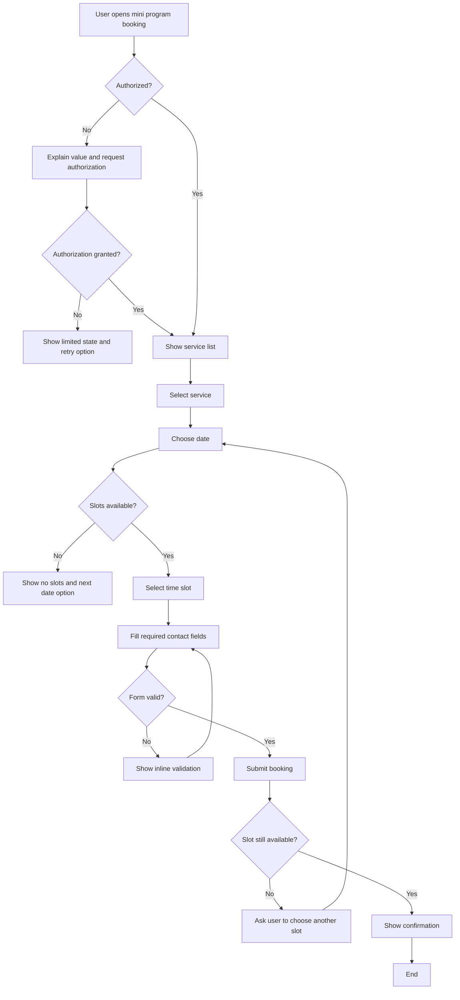

# User Flow

## Legend

| Shape | Meaning |
|---|---|
| Rectangle | Mini Program page, form state, or action |
| Diamond | Authorization, availability, validation, or API decision |

## Notes

- Authorization denial leads to a limited retry state.
- Slot availability must be checked again on submit.
