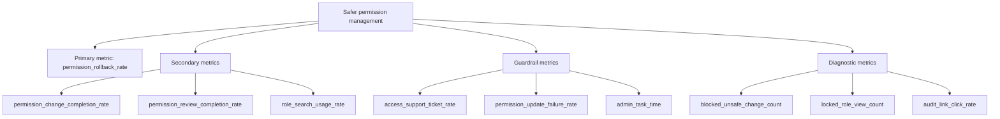

# Metrics Tree

## Product Goal

Reduce accidental permission changes while helping admins manage workspace access confidently.

## KPI Tree

## Metric Definitions

| Metric | Definition | Type | Window |
|---|---|---|---|
| permission_rollback_rate | Permission changes reverted within 7 days / permission changes | Primary | 7 days |
| permission_change_completion_rate | Successful permission changes / role selections | Secondary | Session |
| permission_review_completion_rate | Confirmed changes / confirmation panel views | Secondary | Session |
| role_search_usage_rate | Sessions using search or filter / permission page sessions | Secondary | Session |
| access_support_ticket_rate | Access-related support tickets / active workspaces | Guardrail | Weekly |
| permission_update_failure_rate | Failed permission updates / submitted updates | Guardrail | Daily |
| admin_task_time | Median time from page view to completed change | Guardrail | Session |
| blocked_unsafe_change_count | Count of blocked unsafe role changes | Diagnostic | Daily |
| locked_role_view_count | Views of directory-locked role state | Diagnostic | Daily |
| audit_link_click_rate | Audit link clicks / successful permission changes | Diagnostic | Session |

## Measurement Assumptions

- Rollbacks can be detected from audit log events.
- Support tickets have access-related categorization.
- Workspace identifiers are approved for analytics use.
