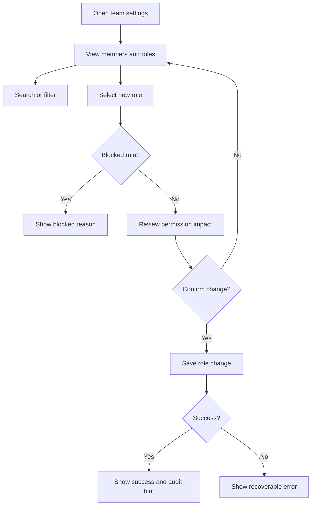

# Team Permission Management PRD

## Version History

| Version | Date | Author | Change |
|---|---|---|---|
| v0.1 | 2026-05-18 | PM Copilot | Initial PRD/prototype delivery example |

## Requirement Input and Confirmation Record

| Item | Status | Record |
|---|---|---|
| Original request | Confirmed | Workspace admins need a better way to manage team permissions because changes are confusing and create support tickets. |
| Target platform | Confirmed | Web admin surface. |
| Business goal | Confirmed | Reduce accidental permission changes and make role assignment easier to review. |
| Current role model | Open | Exact v1 roles and directory-sync constraints are not provided. |
| Audit data | Open | Available audit log fields must be confirmed before engineering handoff. |

## Readiness

| Field | Status | Notes |
|---|---|---|
| PRD status | Ready for review | Consolidated PRD includes requirements, flow, tracking, risks, and validation notes. |
| Engineering handoff status | Draft with confirmation risk | Role list, locked-role rules, and audit log fields must be confirmed. |
| Launch status | Draft | Support and admin help copy can be finalized after role model confirmation. |

## Background

Workspace admins need to assign access safely and understand the impact before a permission change is applied. Current workflows can lead to accidental access grants, support tickets, and audit uncertainty.

## Research and Reference Findings

| Source Type | Finding | Product Impact |
|---|---|---|
| Product context | The request targets an existing team settings/admin area. | Prototype and requirements should adapt a Web admin table instead of inventing a new product. |
| Security reference | Permission changes may expose sensitive workspace data. | Confirmation, self-demotion prevention, and last-owner protection are mandatory. |
| Technical reference | Auditability is required for admin actions. | Requirements must include actor, target, old role, new role, timestamp, and source. |
| Analytics reference | Existing taxonomy is not provided. | Events are proposed and require analytics/engineering approval. |

## Project Goals and Metrics

| Goal | Metric | Target | Type |
|---|---|---|---|
| Reduce accidental permission changes | Permission rollback rate | TBD baseline reduction | Primary |
| Improve admin confidence | Role change confirmation completion rate | TBD | Secondary |
| Improve discoverability | Search/filter usage rate | Directional increase | Diagnostic |
| Avoid access issues | Access-related support ticket rate, failed update rate | No increase | Guardrail |

## Scope

| Scope Type | Items |
|---|---|
| Confirmed MVP | Member role table, search/filter, role change confirmation, affected-permission summary, success/failure states, audit log hint, proposed tracking. |
| Optional or conditional | Approval workflow, only if confirmed as v1 scope. |
| Future scope | Custom roles, advanced directory sync management, full audit log redesign. |
| Non-goals | Authentication redesign, billing seat logic changes, replacing audit infrastructure. |

## Requirement List

| ID | Requirement | Priority | Notes |
|---|---|---|---|
| R1 | Admins can view members, roles, and status in a table. | Must | Web desktop layout. |
| R2 | Admins can search and filter by role or member identity. | Must | Supports larger teams. |
| R3 | Role changes open a confirmation panel before saving. | Must | Prevents accidental changes. |
| R4 | Confirmation includes old role, new role, affected permissions, and target user. | Must | Explains impact. |
| R5 | Successful changes show a status message and audit log hint. | Must | Reinforces accountability. |
| R6 | Failed or blocked changes show recoverable errors. | Must | No silent failures. |
| R7 | Track views, filters, role selection, confirmation, success, failure, and audit-link clicks. | Must | See Tracking Plan in this PRD. |

## Requirement Details

| ID | Function | Scenario | Entry/Trigger | Content Requirements | Business Logic | Interaction Rules | Data Rules | Permissions | Edge States | Tracking | Acceptance |
|---|---|---|---|---|---|---|---|---|---|---|---|
| R1 | Member role table | Admin reviews current access | Team settings page load | Member name, email, role, status, source of role | Show only manageable members for current admin | Table supports scan, pagination if needed | Do not expose hidden members | Owner/admin only | Read-only user, empty team | `team_permissions_viewed` | AC1 |
| R2 | Search and filter | Admin finds a user or role | Search input, role filter | Query, role filter, result count | Filter client/server according to data size | Preserve filters after failed save | Avoid logging raw search text unless approved | Owner/admin only | No results, loading error | `team_permissions_filtered` | AC2 |
| R3 | Role change confirmation | Admin selects a new role | Role dropdown change | Current role, selected role, target user | No save until confirmation succeeds | Use panel/drawer, not instant mutation | Do not persist draft change until confirmed | Owner/admin with role-edit permission | Self-demotion, last owner | `role_change_selected` | AC3 |
| R4 | Permission impact summary | Admin reviews change | Confirmation panel opens | Added/removed permissions, risk note | Compare old/new role permission sets | Highlight sensitive permission changes | Permission set comes from role config | Owner/admin | Unknown role metadata | `role_change_confirm_viewed` | AC4 |
| R5 | Success and audit hint | Role update succeeds | API success | Success message, audit log link, changed role | Refresh table after success | Keep confirmation result visible briefly | Audit record includes actor/target/old/new role | Owner/admin | Audit service delayed | `role_change_succeeded`,`audit_log_clicked` | AC5 |
| R6 | Failure and blocked states | Update fails or action disallowed | API error or local rule | Clear reason and next action | Preserve old role | Retry only for recoverable failures | Error category only, no internal stack | Owner/admin | Directory locked role, permission denied | `role_change_failed` | AC6 |

## Flow Diagram

## Tracking Plan

Analytics taxonomy source: proposed taxonomy; no existing admin analytics convention is provided in the scenario.

| event_name | Description | Trigger | Platform | Actor | required_properties | optional_properties | Success Criteria | Validation Notes | Privacy Notes |
|---|---|---|---|---|---|---|---|---|---|
| `team_permissions_viewed` | Admin opens team permission page | Page render | Web | admin | `workspace_id`,`actor_role` | `member_count_bucket` | Page view coverage exists | Compare with route load | Workspace ID should follow internal analytics policy |
| `team_permissions_filtered` | Admin uses search or role filter | Filter applied | Web | admin | `filter_type`,`result_count_bucket` | `actor_role` | Filter usage measurable | UI filter test | Do not log raw search query by default |
| `role_change_selected` | Admin selects a different role | Role dropdown change | Web | admin | `target_role_old`,`target_role_new`,`actor_role` | `locked_source` | Selection funnel measurable | Dropdown interaction test | Role names only, no private member data |
| `role_change_confirm_viewed` | Confirmation panel appears | Panel opens | Web | admin | `target_role_old`,`target_role_new`,`sensitive_change` | `permission_delta_count` | Impact review measurable | Confirm panel test | No detailed private permission payload |
| `role_change_succeeded` | Role update succeeds | API success | Web | admin | `target_role_old`,`target_role_new`,`actor_role` | `duration_bucket` | Success rate calculable | API success simulation | No target email in event |
| `role_change_failed` | Role update fails or is blocked | API/local error | Web | admin | `error_category`,`target_role_old`,`target_role_new` | `locked_source` | Failure rate visible | Error fixture test | Error category only |
| `audit_log_clicked` | Admin opens audit log hint | Link click | Web | admin | `source`,`actor_role` | `target_role_new` | Audit follow-through measurable | Link click test | No target personal data |

| property_name | Type | Required | Example | Description | Allowed Values | Privacy Level | Source |
|---|---|---|---|---|---|---|---|
| `workspace_id` | string | Yes | `ws_123` | Workspace identifier | Existing IDs | Internal | Workspace service |
| `actor_role` | string | Yes | `owner` | Role of acting admin | `owner`,`admin`,`readonly` | Internal | Auth service |
| `target_role_old` | string | Conditional | `member` | Role before change | Role config | Internal | Role service |
| `target_role_new` | string | Conditional | `admin` | Selected role | Role config | Internal | Role service |
| `sensitive_change` | boolean | Conditional | `true` | Whether role adds sensitive permissions | `true`,`false` | Internal | Permission diff |
| `error_category` | string | Conditional | `last_owner_blocked` | Safe error bucket | Approved categories | Internal | API or local rule |

## Prototype Reference

Prototype file: `prototype-web.html`

The prototype should show the existing-style admin table, search/filter controls, role dropdown, confirmation panel with numbered annotations, blocked states, success message, and audit hint.

## Risks and Open Confirmations

| Item | Severity | Required Before | Owner | Status |
|---|---|---|---|---|
| Exact v1 role list and permission matrix | High | Engineering handoff | Product, Engineering | Open |
| Self-demotion and last-owner rule details | High | Engineering handoff | Product, Security | Open |
| Directory sync locked-role behavior | Medium | Engineering handoff | Engineering | Open |
| Audit log field availability | Medium | Engineering handoff | Engineering | Open |
| Support/help copy | Low | Launch | Product, Support | Open |

## Acceptance Criteria

| ID | Criteria | Verification |
|---|---|---|
| AC1 | Admin can view role table with member status. | QA with seeded workspace |
| AC2 | Admin can search and filter without losing current table state. | QA interaction test |
| AC3 | Role change cannot be saved without confirmation. | QA interaction test |
| AC4 | Confirmation lists old role, new role, and affected permissions. | Product/design review |
| AC5 | Successful change refreshes the table and exposes audit log hint. | API success test |
| AC6 | Failed or blocked update preserves old role and shows a clear reason. | Failure simulation |
| AC7 | Required analytics events fire with approved properties. | Analytics QA |

## Delivery Review Findings

| Severity | Artifact | Finding | Evidence | Owner | Required Before | Status |
|---|---|---|---|---|---|---|
| High | PRD | Role matrix is required before engineering-ready handoff. | Risks list exact role list and permission matrix as open. | Product, Engineering | Engineering handoff | Open |
| Medium | PRD | Event taxonomy is proposed, not approved. | Tracking Plan states no existing taxonomy source was provided. | Analytics | Engineering handoff | Open |
| Low | Prototype | Prototype is suitable for review but not production code. | Prototype reference is paired with HTML artifact only. | Design, Engineering | Implementation | Noted |

## Validation Results

| Check | Result | Notes |
|---|---|---|
| PRD structure | Passed | Default delivery is consolidated into this PRD. |
| Prototype reference | Passed | `prototype-web.html` exists as the paired artifact. |
| Security review | Pending | Role matrix and blocked rules require confirmation. |
| Analytics review | Pending | Event taxonomy is proposed until approved. |
