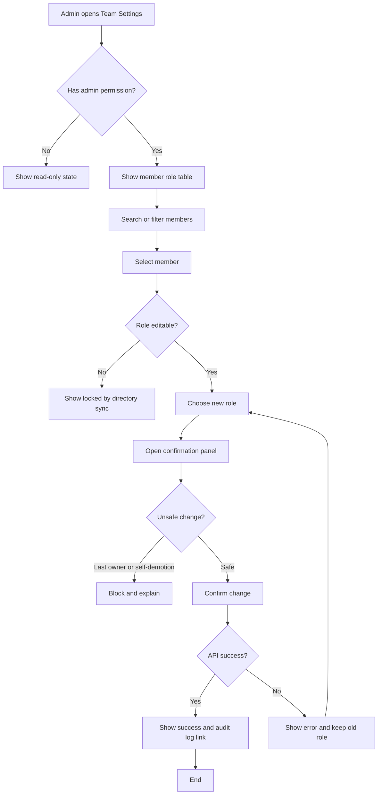

# User Flow

## Legend

| Shape | Meaning |
|---|---|
| Rectangle | Screen, state, or user action |
| Diamond | Permission, safety, or API decision |
| Labeled arrow | Branch condition |

## Notes

- Last owner and self-demotion states block submission.
- Directory-synced roles are visible but not editable.
- API failure keeps the previous role and returns the admin to role selection.
