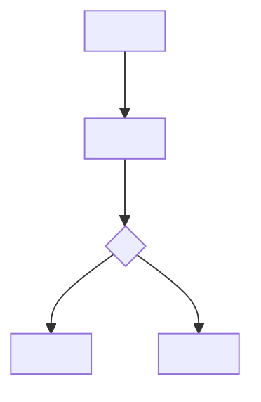

# <feature-name> PRD

<!--
Use this template only for implemented-feature PRD delivery.
All human-facing headings and table labels must be localized before delivery.
Keep requirement IDs, event names, property names, file names, and run ids in ASCII where they are machine identifiers.
Remove this note from generated artifacts.
-->

## 1. <document information>

| <item>                       | <content> |
| ---------------------------- | --------- |
| <feature name>               |           |
| <branch / version>           |           |
| <document date>              |           |
| <related modules>            |           |
| <PRD status>                 |           |
| <engineering handoff status> |           |
| <launch status>              |           |

## 2. <version history>

| <version> | <date> | <change summary> | <owner> |
| --------- | ------ | ---------------- | ------- |

## 3. <background and current problems>

## 4. <product goals and metrics>

| ID  | <goal> | <metric> | <target / direction> | <measurement note> |
| --- | ------ | -------- | -------------------- | ------------------ |

## 5. <users and scenarios>

| ID  | <user / role> | <scenario> | <desired outcome> |
| --- | ------------- | ---------- | ----------------- |

## 6. <scope>

### 6.1 <in scope>

| ID  | <scope item> | <source evidence> | <priority> |
| --- | ------------ | ----------------- | ---------- |

### 6.2 <out of scope>

| ID  | <out-of-scope item> | <reason> |
| --- | ------------------- | -------- |

## 7. <information architecture and entry points>

| ID  | <entry / surface> | <visible condition> | <target state> | <permission / fallback> |
| --- | ----------------- | ------------------- | -------------- | ----------------------- |

## 8. <functional requirements>

### 8.1 <requirement name>

<!--
Put screenshots or missing-image placeholders directly below the requirement heading or inside the relevant row.
Cover every independent page, window, panel, or dialog changed by the feature. Do not split micro-states into separate screenshots when one screenshot can show the complete window or panel.
Missing-image placeholder format must be exactly:

> 占位图：<recommended-image-name>.png
> 用途：<one sentence describing the UI state, dialog, or requirement position>

When the real image exists, replace the whole placeholder block with:


Name missing and real screenshots by content. When one object has multiple states, use object-specific state names such as `文件上传-上传中.png` and `文件上传-上传失败.png`, not `文件上传-状态.png`.

Do not create a separate screenshot/image list. Keep the image or placeholder fused with the requirement detail it explains.
-->

| ID  | <function> | <user scenario> | <entry / trigger> | <content requirements> | <business logic> | <interaction rules> | <data rules> | <permission rules> | <edge states> | <tracking links> | <acceptance links> |
| --- | ---------- | --------------- | ----------------- | ---------------------- | ---------------- | ------------------- | ------------ | ------------------ | ------------- | ---------------- | ------------------ |

## 9. <parameters and rules>

### 9.1 <parameter group>

| <parameter> | <type> | <source> | <usage> | <rule / limit> |
| ----------- | ------ | -------- | ------- | -------------- |

## 10. <states and exceptions>

| ID  | <state / exception> | <trigger> | <display / behavior> | <recovery / next action> | <related requirement IDs> |
| --- | ------------------- | --------- | -------------------- | ------------------------ | ------------------------- |

## 11. <permissions and operation boundaries>

| <role / asset / object> | <view> | <create> | <edit> | <delete> | <batch action> | <notes> |
| ----------------------- | ------ | -------- | ------ | -------- | -------------- | ------- |

## 12. <data and API requirements>

### 12.1 <existing calls or implemented data source>

| <capability> | <current source / endpoint> | <frontend usage> | <limitation> |
| ------------ | --------------------------- | ---------------- | ------------ |

### 12.2 <backend requirements>

| ID  | <capability> | <method / endpoint proposal> | <request fields> | <response fields> | <error codes / states> | <frontend integration note> |
| --- | ------------ | ---------------------------- | ---------------- | ----------------- | ---------------------- | --------------------------- |

## 13. <frontend real-data integration notes>

| ID  | <current implementation state> | <real-data integration requirement> | <affected files / modules> |
| --- | ------------------------------ | ----------------------------------- | -------------------------- |

## 14. <tracking and monitoring>

| <event_name> | <description> | <trigger> | <required_properties> | <success criteria> | <privacy note> |
| ------------ | ------------- | --------- | --------------------- | ------------------ | -------------- |

## 15. <copy and i18n>

| <key / scene> | <copy> | <usage> | <i18n note> |
| ------------- | ------ | ------- | ----------- |

### 15.1 <new copy extraction>

<!--
List newly added or changed UI copy as pure text so PMs can copy it into an i18n request. If there is no new copy, state that explicitly and remove this block.
-->

```text
<new or changed UI copy line>
```

## 16. <functional flow diagram>

<!--
Use a Mermaid flowchart here. Do not use a table or PNG for the primary flow diagram.
Keep node IDs ASCII and labels localized.
-->



## 17. <acceptance criteria>

| ID  | <requirement IDs> | <criteria> | <verification method> |
| --- | ----------------- | ---------- | --------------------- |

## 18. <test suggestions>

| <test type> | <coverage> | <suggested cases> |
| ----------- | ---------- | ----------------- |

## 19. <risks and dependencies>

| ID  | <risk / dependency> | <impact> | <owner> | <mitigation / decision> |
| --- | ------------------- | -------- | ------- | ----------------------- |

## 20. <implementation evidence and coverage map>

| <evidence ID> | <source> | <observed behavior> | <related requirement IDs> | <coverage status> | <gap / risk> |
| ------------- | -------- | ------------------- | ------------------------- | ----------------- | ------------ |

## 21. <reference code locations>

| <module> | <path> | <note> |
| -------- | ------ | ------ |
