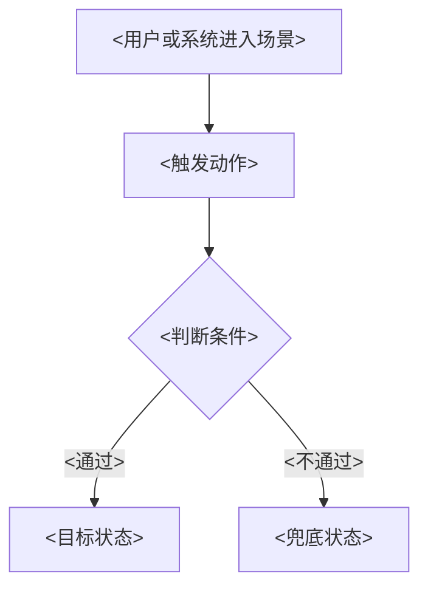

# <一句话需求> - <YYYY-MM-DD>

<!--
Use this template for implemented-feature PRD delivery.
All generated PRDs must keep the numbered section order below.
The H1 must be one concise requirement sentence plus the requirement date, not a topic list plus "PRD".
Human-facing headings, labels, statuses, and notes must be localized before delivery.
Keep requirement IDs, event names, property names, file names, paths, and Mermaid node IDs in ASCII where they are machine identifiers.
Content applicability rules:
- Keep top-level sections 1-14 in implemented-feature mode because code evidence exists by definition.
- If a required top-level section has no applicable content, write one explicit localized `Not applicable: <reason>` line or row instead of leaving it empty.
- Remove optional subsections, diagrams, image blocks, matrices, or evidence rows that do not apply. Do not leave empty tables, placeholder angle-bracket text, or "TBD" content.
- Flow diagrams are optional and must follow the specific requirement they explain. Put each Mermaid diagram inside that requirement's subsection, not as generic global `User flow` and `Functional flow` sections.
Remove this note from generated artifacts.
-->

## 1. <文档信息>

| <项目> | <内容> |
| --- | --- |
| <一句话需求> |  |
| <需求日期> |  |
| <需求来源> |  |
| <分支 / 版本> |  |
| <相关模块> |  |
| <PRD 状态> |  |
| <研发交接状态> |  |
| <上线状态> |  |

## 2. <版本记录>

| <版本> | <日期> | <变更摘要> | <负责人> |
| --- | --- | --- | --- |

## 3. <需求背景>

<!-- Explain the current problem, business/user impact, and why this requirement is needed now. For implemented features, separate observed implementation facts from inferred product intent. -->

## 4. <需求目标>

| ID | <目标> | <指标> | <目标方向> | <测量说明> |
| --- | --- | --- | --- | --- |

## 5. <需求调研>

<!-- This section must cover users and scenarios, current-product research, implementation evidence, external research when available, and reusable conclusions. Repository facts are current-product context, not competitor research. -->

### 5.1 <用户与场景>

| ID | <用户 / 角色> | <场景> | <期望结果> |
| --- | --- | --- | --- |

### 5.2 <现状调研>

| <调研项> | <结论> | <产品影响> |
| --- | --- | --- |

### 5.3 <外部调研与限制>

| <调研来源> | <状态> | <结论 / 限制> | <影响> |
| --- | --- | --- | --- |

### 5.4 <调研结论>

| ID | <结论> | <对应需求> |
| --- | --- | --- |

## 6. <需求列表>

<!-- Requirement list is a scan-level summary only. Complete behavior belongs in section 7. -->

| ID | <需求简述> | <用户价值> | <优先级> | <状态> |
| --- | --- | --- | --- | --- |

## 7. <需求详情>

<!--
Requirement details are the most important part of the PRD.
Each requirement should cover scenario, entry/trigger, content, business rules, interaction rules, data/state rules, permissions, edge states, tracking links, acceptance links, and screenshots/figures.
For frontend UI/page/component changes, include the implemented UI specification in the requirement detail: affected page/component, layout/alignment, dimensions, spacing, typography, color/token, icon/image requirements, component states, responsive behavior, accessibility/focus behavior, and visual acceptance notes.
Flow diagrams are optional. Add them only when a specific requirement has a complex user path, cross-system process, or many states; place the Mermaid block inside that requirement's subsection.
Screenshots and placeholders must appear inside the relevant requirement detail, not in a detached image list.

Missing-image placeholder format must be exactly:

> 占位图：<recommended-image-name>.png
> 用途：<one sentence describing the UI state, dialog, or requirement position>

When the real image exists, replace the whole placeholder block with:

-->

### 7.1 <R1 需求名称>

<!-- Optional, include only when this requirement needs a flow diagram:
#### <操作 / 功能流程图>


-->

| <维度> | <需求说明> |
| --- | --- |
| <用户场景> |  |
| <入口 / 触发> |  |
| <内容要求> |  |
| <前端界面规格> | <Only keep for UI/page/component changes. Include affected component, layout/alignment, size, spacing, typography, color/token, icon/image, states, responsive/accessibility notes, and visual acceptance notes.> |
| <业务逻辑> |  |
| <交互规则> |  |
| <数据规则> |  |
| <权限和边界> |  |
| <加载 / 空 / 错误状态> |  |
| <埋点> |  |
| <验收> |  |
| <图示> |  |

## 8. <埋点需求>

<!-- If no approved taxonomy is found, explicitly mark the table as proposed and name the source gap. -->

| <事件名> (`event_name`) | <事件说明> (`description`) | <触发时机> (`trigger`) | <平台> (`platform`) | <主体> (`actor`) | <必填属性> (`required_properties`) | <可选属性> (`optional_properties`) | <成功标准> (`success_criteria`) | <验证说明> (`validation_notes`) | <隐私说明> (`privacy_notes`) |
| --- | --- | --- | --- | --- | --- | --- | --- | --- | --- |

### 8.1 <属性字典>

| <属性名> (`property_name`) | <类型> (`type`) | <是否必填> (`required`) | <示例> (`example`) | <说明> (`description`) | <可选值> (`allowed_values`) | <隐私级别> (`privacy_level`) | <来源> (`source`) |
| --- | --- | --- | --- | --- | --- | --- | --- |

## 9. <多语言需求>

<!-- Put only user-facing copy in the pure-text block. Keep keys and usage notes in the table below. If there is no new copy, state that explicitly. -->

### 9.1 <纯文本提取>

```text
<new or changed UI copy line>
```

### 9.2 <使用位置映射>

| <文案> | <使用位置> | <多语言说明> |
| --- | --- | --- |

## 10. <验收标准>

| ID | <关联需求> | <验收标准> | <验证方法> |
| --- | --- | --- | --- |

## 11. <测试建议>

| <测试类型> | <覆盖范围> | <建议用例> |
| --- | --- | --- |

## 12. <代码实现说明>

<!-- Required for implemented-feature PRDs. Include implementation scope, data/API notes, parameters/rules, states/exceptions, risks/dependencies, and implementation evidence. -->

### 12.1 <实现范围>

| <模块> | <实现说明> | <关联需求> |
| --- | --- | --- |

### 12.2 <参数、状态与接口规则>

| <规则类型> | <规则说明> | <关联需求> |
| --- | --- | --- |

### 12.3 <风险与依赖>

| ID | <风险 / 依赖> | <影响> | <负责人> | <缓解 / 决策> |
| --- | --- | --- | --- | --- |

### 12.4 <实现证据和覆盖映射>

| <证据 ID> | <来源> | <观察到的行为> | <关联需求> | <覆盖状态> | <缺口 / 风险> |
| --- | --- | --- | --- | --- | --- |

## 13. <代码位置>

| <模块> | <路径> | <说明> |
| --- | --- | --- |

## 14. <验证结果>

| <验证项> | <命令> | <结果> | <说明> |
| --- | --- | --- | --- |
