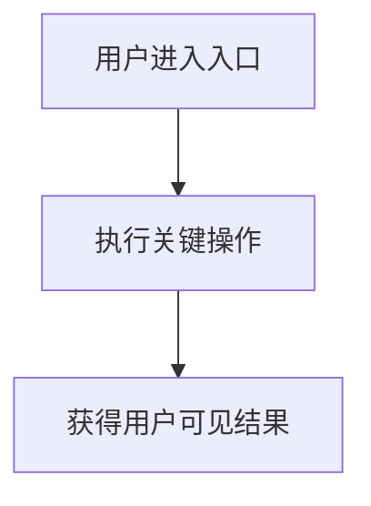
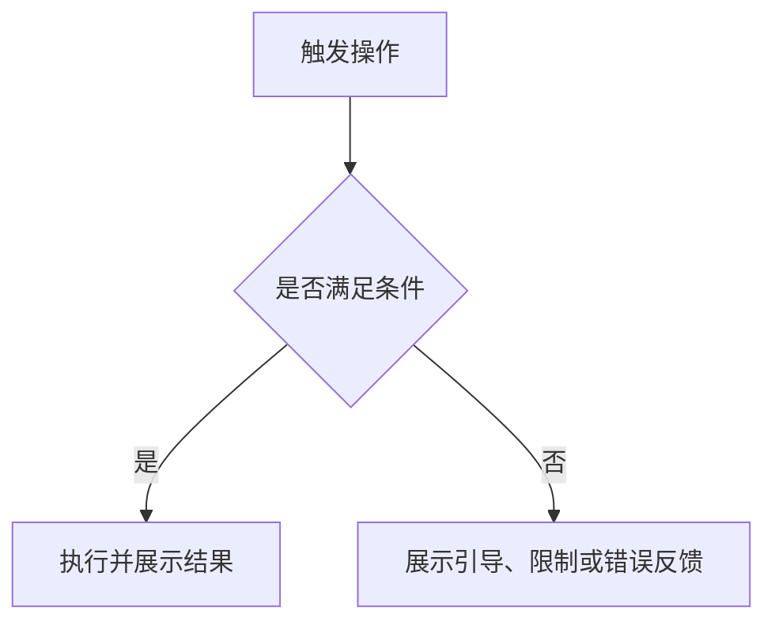

<!--
生成规则：先按本模板完整起草，再删除本次没有真实内容的整章、流程图块和图示行；不得在最终 PRD 保留空标题、空表格、方括号占位符或本注释。
章节编号随保留章节连续调整；需求详情编号与最终“需求详情”章节编号一致。
-->
# 需求名称 - YYYY-MM-DD

## 一、文档说明

### 1. 文档信息

| 项目 | 内容 |
| --- | --- |
| 需求来源 | [用户需求 / 已交付功能的产品行为还原 / 调研结论] |
| 目标用户 | [目标用户] |
| 影响范围 | [受影响的页面、流程或功能] |
| 文档状态 | [可评审 / 可评审（图示待人工补全）] |
| 文档负责人 | [负责人] |

### 2. 版本记录

| 版本 | 日期 | 变更内容 | 负责人 |
| --- | --- | --- | --- |
| v0.1 | [YYYY-MM-DD] | 首次创建 | [负责人] |

## 二、需求背景

[说明目标用户在具体场景中遇到的问题、问题原因和本次要达成的用户结果；不写技术实现方案。]

## 三、需求调研

| ID | 来源与日期 | 发现 | 对本次需求的影响 | 关联需求 |
| --- | --- | --- | --- | --- |
| R-01 | [来源与日期] | [事实、反馈或调研结论] | [由此产生的产品判断] | [需求编号] |

## 四、需求清单

| 详情编号 | 需求名称 | 目标用户 | 用户场景 / 触发 | 用户问题或价值 | 需求摘要 | 优先级 | 来源 / 确认状态 |
| --- | --- | --- | --- | --- | --- | --- | --- |
| 5.1 | [需求名称] | [目标用户] | [用户场景或触发条件] | [用户问题或价值] | [一句话需求摘要] | P0 | [已确认 / 已观察 / 待确认] |

## 五、需求详情

### 5.1 [需求名称]

#### 用户流程图


```mermaid
flowchart TD
  A[用户进入入口] --> B[执行关键操作]
  B --> C[获得用户可见结果]
```

#### 操作流程图


```mermaid
flowchart TD
  A[触发操作] --> B{是否满足条件}
  B -- 是 --> C[执行并展示结果]
  B -- 否 --> D[展示引导、限制或错误反馈]
```

| 维度 | 需求说明 |
| --- | --- |
| 用户与场景 | [谁在什么场景下需要完成什么目标] |
| 需求入口 | [用户从哪里进入、如何触发、适用条件] |
| 需求详情 | 一、主流程<br>1. [用户操作与产品响应]<br>2. [用户操作与产品响应]<br>二、状态与反馈<br>1. [空态、加载、成功、失败、权限或恢复规则]<br>2. [对应的恢复、降级或边界规则] |
| 设计与交互 | [信息层级、可见控件、交互反馈、可访问性和边界] |
| 图示 | 占位图：[功能]-[状态].png |

### 5.2 [需求名称]

[按 5.1 的完整结构编写；没有用户流程图、操作流程图或图示时，删除对应完整块或表格行。]

## 六、多语言需求

```text
[新增或修改的中文用户可见文案]
```

| 文案 | 使用位置 | 参数 |
| --- | --- | --- |
| [中文文案] | [需求编号或用户可见位置] | / |
| [带变量的中文文案，例如：操作失败：{reason}] | [需求编号或用户可见位置] | {reason} |

## 七、埋点需求

| 事件 | 事件名称 | 上报时机 | 附加参数 | 备注 |
| --- | --- | --- | --- | --- |
| [用户可理解的事件名称] | feature_action | [可观察的触发时刻] | [产品判断需要的上下文] | [指标目的或 /] |
