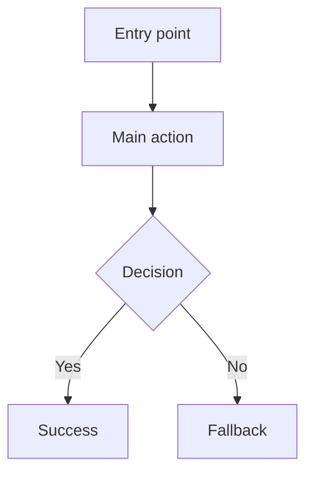

# PM Package

## Executive Summary

## Context And Current-State Fit

## Clarification Status

### Must Answer Before Generation

| Question | Why It Blocks | Owner |
|---|---|---|

### Can Draft With Stated Assumption

| Assumption | Why Reasonable | Risk |
|---|---|---|

### Must Confirm Before Development Or Launch

| Item | Why It Matters | Owner |
|---|---|---|

## PRD

## Metrics Tree

## Tracking Plan

### Event Table

| event_name | description | trigger | platform | actor | required_properties | optional_properties | success_criteria | validation_notes | privacy_notes |
|---|---|---|---|---|---|---|---|---|---|

### Property Dictionary

| property_name | type | required | example | description | allowed_values | privacy_level | source |
|---|---|---|---|---|---|---|---|

## User Flow

## Prototype

- File:
- Fidelity:
- Main interactions:
- Key annotations:
- Implementation notes:

## Review Checklist

## Artifact Index

| Artifact | File | Purpose |
|---|---|---|

## Risks And Next Actions
