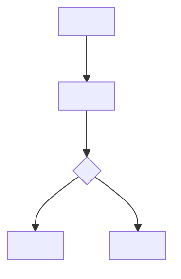

# <localized package title>

<!-- Template note: this file defines semantic sections, not literal English headings. Replace every <localized ...> placeholder with the user's language before generating a real artifact. Keep file names, event names, property names, and IDs in ASCII. Remove this note from generated artifacts. -->

## <localized executive summary>

## <localized context and current-state fit>

## <localized clarification status>

### <localized must answer before generation>

| <localized question> | <localized why it blocks> | <localized owner> |
|---|---|---|

### <localized can draft with stated assumption>

| <localized assumption> | <localized why reasonable> | <localized risk> |
|---|---|---|

### <localized must confirm before development or launch>

| <localized item> | <localized why it matters> | <localized owner> |
|---|---|---|

## <localized PRD>

## <localized metrics tree>

## <localized tracking plan>

### <localized event table>

| <localized event name> (`event_name`) | <localized event description> (`description`) | <localized trigger> (`trigger`) | <localized platform> (`platform`) | <localized actor> (`actor`) | <localized required properties> (`required_properties`) | <localized optional properties> (`optional_properties`) | <localized success criteria> (`success_criteria`) | <localized validation notes> (`validation_notes`) | <localized privacy notes> (`privacy_notes`) |
|---|---|---|---|---|---|---|---|---|---|

### <localized property dictionary>

| <localized property name> (`property_name`) | <localized type> (`type`) | <localized required> (`required`) | <localized example> (`example`) | <localized description> (`description`) | <localized allowed values> (`allowed_values`) | <localized privacy level> (`privacy_level`) | <localized source> (`source`) |
|---|---|---|---|---|---|---|---|

## <localized user flow>

## <localized prototype>

- <localized file>:
- <localized fidelity>:
- <localized main interactions>:
- <localized key annotations>:
- <localized implementation notes>:

## <localized review checklist>

## <localized artifact index>

| <localized artifact> | <localized file> | <localized purpose> |
|---|---|---|

## <localized risks and next actions>
