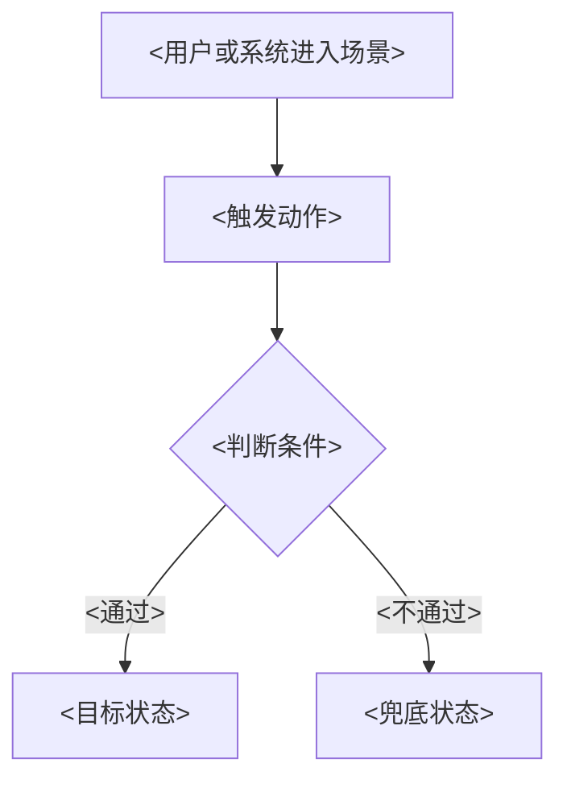

# <一句话需求> - <YYYY-MM-DD>

<!--
This template defines PM Copilot's default PRD structure.
Generated PRDs must keep the numbered section order below.
The H1 must be one concise requirement sentence plus the requirement date, not a topic list plus "PRD".
Localize all human-facing headings and labels to the user's language. Keep IDs, event names, property names, file names, and Mermaid node IDs ASCII.
Content applicability rules:
- Keep top-level sections 1-11. If a required top-level section has no applicable content, write one explicit localized `Not applicable: <reason>` line or row instead of leaving it empty.
- Remove optional subsections, example tables, diagrams, image blocks, risk/API/detail matrices, or other blocks that do not apply. Do not leave empty tables, placeholder angle-bracket text, or "TBD" content.
- Do not add code-related top-level sections unless the PRD is reconstructed from implemented code. Use `implemented-feature-prd-template.md` for that mode.
- Flow diagrams are optional and follow the relevant requirement. Put each diagram inside the specific requirement subsection it explains; do not create generic `User flow` and `Functional flow` subsections for every PRD.
Remove this note from generated artifacts.
-->

## 1. <文档信息>

| <项目> | <内容> |
| --- | --- |
| <一句话需求> |  |
| <需求日期> |  |
| <需求来源> |  |
| <相关模块 / 平台> |  |
| <PRD 状态> |  |
| <研发交接状态> |  |
| <上线状态> |  |

## 2. <版本记录>

| <版本> | <日期> | <变更摘要> | <负责人> |
| --- | --- | --- | --- |

## 3. <需求背景>

<!-- Explain user pain, business context, current-product problem, and why the requirement is needed now. -->

## 4. <需求目标>

| ID | <目标> | <指标> | <目标方向> | <测量说明> |
| --- | --- | --- | --- | --- |

## 5. <需求调研>

<!-- Cover users, scenarios, current-product research, external research when available, assumptions, rejected options, and reusable conclusions. -->

### 5.1 <用户与场景>

| ID | <用户 / 角色> | <场景> | <期望结果> |
| --- | --- | --- | --- |

### 5.2 <现状调研>

| <调研项> | <结论> | <产品影响> |
| --- | --- | --- |

### 5.3 <外部调研与限制>

| <调研来源> | <状态> | <结论 / 限制> | <影响> |
| --- | --- | --- | --- |

### 5.4 <调研结论>

| ID | <结论> | <对应需求> |
| --- | --- | --- |

## 6. <需求列表>

<!-- Requirement list is a scan-level summary only. Complete behavior belongs in section 7. -->

| ID | <需求简述> | <用户价值> | <优先级> | <状态> |
| --- | --- | --- | --- | --- |

## 7. <需求详情>

<!--
This is the most important PRD section.
Each functional item should cover scenario, entry/trigger, content, business logic, interaction rules, data/state rules, permissions, edge cases, tracking links, and acceptance links.
For frontend UI/page/component changes, include the relevant UI specification in the requirement detail: affected page/component, layout/alignment, dimensions, spacing, typography, color/token, icon/image requirements, component states, responsive behavior, accessibility/focus behavior, and visual acceptance notes.
Flow diagrams are optional. Add them only when a specific requirement has a complex user path, cross-system process, or many states; place the Mermaid block inside that requirement's subsection.
Screenshots and missing-image placeholders belong inline with the requirement they explain, never in a detached image list.
-->

### 7.1 <R1 需求名称>

<!-- Optional, include only when this requirement needs a flow diagram:
#### <操作 / 功能流程图>


-->

| <维度> | <需求说明> |
| --- | --- |
| <用户场景> |  |
| <入口 / 触发> |  |
| <内容要求> |  |
| <前端界面规格> | <Only keep for UI/page/component changes. Include affected component, layout/alignment, size, spacing, typography, color/token, icon/image, states, responsive/accessibility notes, and visual acceptance notes.> |
| <业务逻辑> |  |
| <交互规则> |  |
| <数据规则> |  |
| <权限和边界> |  |
| <加载 / 空 / 错误状态> |  |
| <埋点> |  |
| <验收> |  |
| <图示> |  |

## 8. <埋点需求>

<!-- If no approved taxonomy is found, explicitly mark this as a proposed taxonomy and name the source gap. -->

| <事件名> (`event_name`) | <事件说明> (`description`) | <触发时机> (`trigger`) | <平台> (`platform`) | <主体> (`actor`) | <必填属性> (`required_properties`) | <可选属性> (`optional_properties`) | <成功标准> (`success_criteria`) | <验证说明> (`validation_notes`) | <隐私说明> (`privacy_notes`) |
| --- | --- | --- | --- | --- | --- | --- | --- | --- | --- |

### 8.1 <属性字典>

| <属性名> (`property_name`) | <类型> (`type`) | <是否必填> (`required`) | <示例> (`example`) | <说明> (`description`) | <可选值> (`allowed_values`) | <隐私级别> (`privacy_level`) | <来源> (`source`) |
| --- | --- | --- | --- | --- | --- | --- | --- |

## 9. <多语言需求>

<!-- Put only user-facing copy in the pure-text block. Keep keys and usage notes in the table below. If there is no new copy, state that explicitly. -->

### 9.1 <纯文本提取>

```text
<new or changed UI copy line>
```

### 9.2 <使用位置映射>

| <文案> | <使用位置> | <多语言说明> |
| --- | --- | --- |

## 10. <验收标准>

| ID | <关联需求> | <验收标准> | <验证方法> |
| --- | --- | --- | --- |

## 11. <测试建议>

| <测试类型> | <覆盖范围> | <建议用例> |
| --- | --- | --- |
