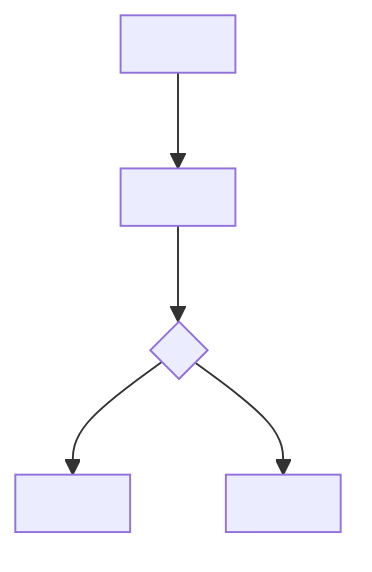
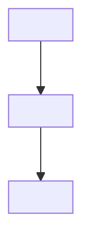

# <localized feature name> PRD

<!-- Template note: this file defines semantic sections, not literal English headings. Replace every <localized ...> placeholder with the user's language before generating a real artifact. Keep requirement IDs, event names, property names, and Mermaid node IDs in ASCII. Remove this note from generated artifacts. -->

## <localized version history>

| <localized version> | <localized date> | <localized change summary> | <localized owner> |
|---|---|---|---|

## <localized requirement input and confirmation record>

| <localized item> | <localized source or answer> | <localized status> | <localized blocks phase> | <localized impact> |
|---|---|---|---|---|

## <localized readiness summary>

| <localized phase> | <localized status> | <localized blockers> | <localized owner> |
|---|---|---|---|
| PRD |  |  |  |
| <localized engineering handoff> |  |  |  |
| <localized launch> |  |  |  |

## <localized background>

## <localized research and reference findings>

### <localized user or business research>

### <localized competitor research>

### <localized technical solution reference>

### <localized reusable conclusions>

### <localized rejected options and reasons>

## <localized project goals and metrics>

| <localized goal> | <localized metric> | <localized target> | <localized measurement note> |
|---|---|---|---|

## <localized requirement scope>

### <localized surface and permission states>

| <localized item> | <localized decision> | <localized verification> |
|---|---|---|
| <localized entry point> |  |  |
| <localized navigation visibility> |  |  |
| <localized eligible user state> |  |  |
| <localized ineligible user state> |  |  |
| <localized fallback states> |  |  |

### <localized confirmed MVP scope>

| <localized area> | <localized included requirement> | <localized owner> | <localized verification> |
|---|---|---|---|

### <localized optional or conditional scope>

| <localized capability> | <localized decision needed> | <localized owner> |
|---|---|---|

### <localized future scope>

| <localized capability> | <localized trigger or reason> |
|---|---|

### <localized non-goals>

| <localized non-goal> | <localized reason> |
|---|---|

### <localized content source and review status>

| <localized content area> | <localized source status> | <localized review owner> | <localized review status> | <localized disclaimer status> | <localized launch impact> |
|---|---|---|---|---|---|

## <localized implementation evidence and coverage map>

<!-- Use this section when the PRD is reconstructed from an implemented branch/current diff. Remove it only when no implementation evidence exists. Screenshots or placeholders should appear inline in the related evidence/requirement row, not in a separate image list. -->

| <localized evidence id> | <localized source> | <localized observed behavior> | <localized related requirement ids> | <localized coverage status> | <localized gap or risk> |
|---|---|---|---|---|---|

## <localized requirement list>

| ID | <localized requirement item> | <localized priority> | <localized status> | <localized notes> |
|---|---|---|---|---|

## <localized requirement details>

<!-- The requirement list is a rough overview only. This section must be the complete functional explanation. Use a full detail table or per-function subsections, but keep requirement screenshots/placeholders inline with the function they explain. Keep Markdown table separators consistently left-aligned (`---`) unless a special data table requires otherwise. -->

| ID | <localized function> | <localized scenario> | <localized entry or trigger> | <localized content requirements> | <localized business logic> | <localized interaction rules> | <localized data rules> | <localized permission rules> | <localized edge states> | <localized tracking links> | <localized acceptance links> |
|---|---|---|---|---|---|---|---|---|---|---|---|

## <localized copy and i18n>

<!-- Put only user-facing copy in the pure-text block. Keep keys and usage notes in the mapping table below. If there is no new copy, state that explicitly. -->

### <localized new copy pure text>

```text
<localized new or changed UI copy line>
```

### <localized key and usage mapping>

| <localized key> | <localized copy> | <localized usage> | <localized note> |
|---|---|---|---|

## <localized flow diagrams>

### <localized functional flow>



### <localized operation flow>



## <localized tracking plan>

| <localized tracking taxonomy source> | <localized value> |
|---|---|
| <localized source status> | <localized existing taxonomy followed / proposed taxonomy because no source was found / tracking omitted> |

### <localized event table>

| <localized event name> (`event_name`) | <localized event description> (`description`) | <localized trigger> (`trigger`) | <localized platform> (`platform`) | <localized actor> (`actor`) | <localized required properties> (`required_properties`) | <localized optional properties> (`optional_properties`) | <localized success criteria> (`success_criteria`) | <localized validation notes> (`validation_notes`) | <localized privacy notes> (`privacy_notes`) |
|---|---|---|---|---|---|---|---|---|---|

### <localized property dictionary>

| <localized property name> (`property_name`) | <localized type> (`type`) | <localized required> (`required`) | <localized example> (`example`) | <localized description> (`description`) | <localized allowed values> (`allowed_values`) | <localized privacy level> (`privacy_level`) | <localized source> (`source`) |
|---|---|---|---|---|---|---|---|

## <localized UI delivery reference>

| <localized item> | <localized value> |
|---|---|
| <localized UI delivery artifact> | <localized source-backed preview/delta path, or `prototype-<platform>.html` only for compatibility HTML mode> |
| <localized PRD HTML document> | <localized `prd.html` when browser-readable PRD delivery is requested; not applicable otherwise> |
| <localized covered screens and states> |  |
| <localized note> | <localized detailed product design, logic rules, and interaction notes live in the numbered annotations inside the UI deliverable> |

## <localized risks and open confirmations>

| ID | <localized item> | <localized impact> | <localized owner> | <localized required before> | <localized status> |
|---|---|---|---|---|---|

## <localized acceptance criteria>

| ID | <localized requirement id> | <localized criteria> | <localized verification> |
|---|---|---|---|

## <localized delivery review findings>

| <localized severity> | <localized artifact> | <localized finding> | <localized evidence> | <localized owner> | <localized required before> | <localized status> |
|---|---|---|---|---|---|---|

## <localized validation results>

| <localized command> | <localized status> | <localized result or limitation> |
|---|---|---|
