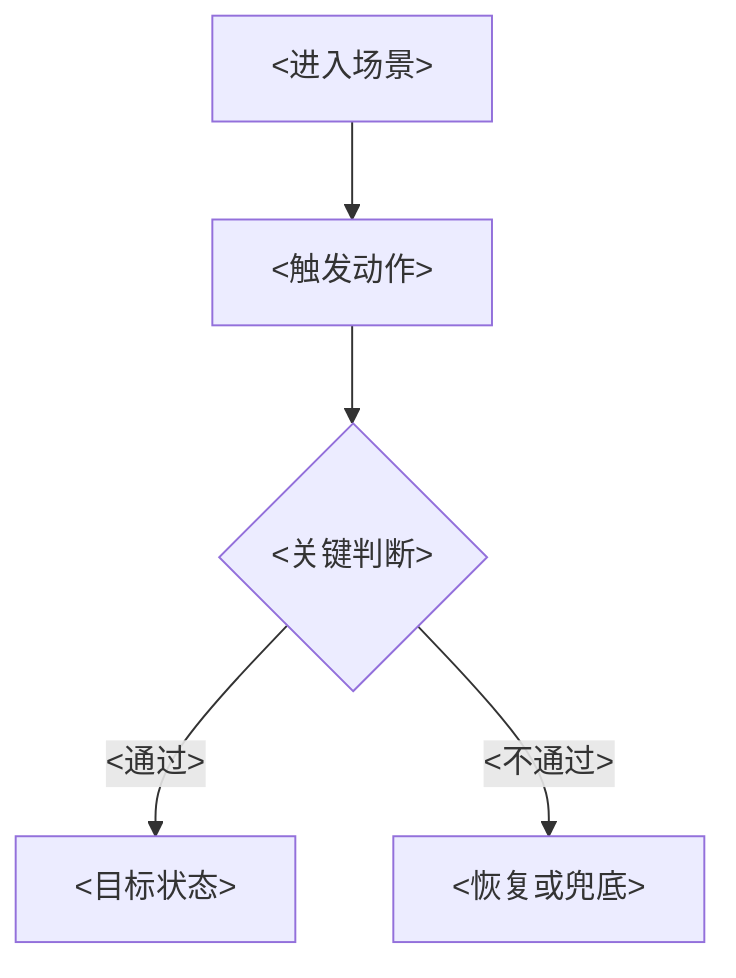

# <一句话需求> - <YYYY-MM-DD>

<!--
This is PM Copilot's decision-first PRD template.
Keep the eight numbered top-level sections in this order. Localize all human-facing text.
Do not preserve empty optional subsections, empty tables, angle-bracket placeholders, or TBD text.
The first screen must let a reviewer understand the recommendation, confidence, scope, blockers, and next checkpoint.
Requirement details are the behavioral source of truth. Do not create a duplicate scan-only requirement list.
Tracking, copy/i18n, UI handoff, engineering notes, and test suggestions are optional subsections inside section 6.
Use implemented-feature-prd-template.md when reconstructing a PRD from implemented code.
Remove this note from generated artifacts.
-->

## 1. <产品决策摘要>

### 1.1 <建议与理由>

<!-- State the recommended product direction in 2-4 sentences. Name the user outcome, key trade-off, and why this option is preferred over the strongest alternative. -->

| <决策项> | <当前判断> |
| --- | --- |
| <推荐方案> |  |
| <置信度> | <高 / 中 / 低，并说明依据> |
| <PRD 状态> |  |
| <研发交接状态> |  |
| <上线状态> |  |
| <关键阻塞> |  |
| <下一检查点> | <负责人 / 阶段 / 完成证据> |

### 1.2 <文档元数据>

| <项目> | <内容> |
| --- | --- |
| <需求来源> |  |
| <需求日期> |  |
| <相关模块 / 平台> |  |
| <本次变更> |  |

## 2. <背景与证据>

### 2.1 <问题与用户场景>

<!-- Describe the current behavior, user pain, affected role/scenario, frequency or severity, and why action is needed now. -->

### 2.2 <证据与限制>

| ID | <来源 / 类型> | <已知事实或发现> | <可信状态> | <产品影响> |
| --- | --- | --- | --- | --- |

### 2.3 <假设与未知项>

| ID | <假设 / 未知项> | <当前处理> | <确认时点> | <影响> |
| --- | --- | --- | --- | --- |

## 3. <目标与成功标准>

| ID | <产品目标> | <用户 / 业务结果> | <指标或可观察信号> | <目标方向 / 阈值> | <验证窗口> |
| --- | --- | --- | --- | --- | --- |

<!-- Include guardrail metrics or failure signals when optimization could create abuse, fatigue, privacy, quality, support, or revenue risk. -->

## 4. <范围与非目标>

| <范围层级> | <内容> | <理由 / 进入条件> |
| --- | --- | --- |
| MVP |  |  |
| <可选> |  |  |
| <未来> |  |  |
| <非目标> |  |  |

## 5. <需求详情>

<!--
Create one subsection per coherent product capability or behavioral change.
Each requirement must be independently reviewable and traceable to goals and acceptance criteria.
Use prose, a compact table, or both. Keep only applicable rows.
Flow diagrams are optional and belong inside the requirement they explain.
Place screenshots or exact inline placeholders at the requirement position they support.
-->

### 5.1 <R1 需求名称>

**产品判断：** <What behavior should exist and why this is the chosen behavior.>

| <维度> | <需求说明> |
| --- | --- |
| <用户场景与价值> |  |
| <入口 / 触发> |  |
| <主流程与业务规则> |  |
| <内容 / 文案> |  |
| <界面与交互> | <Only when UI is in scope: affected surface, hierarchy, states, responsive/accessibility behavior, and visual acceptance.> |
| <数据与状态> |  |
| <权限与边界> |  |
| <加载 / 空 / 错误 / 恢复> |  |
| <依赖与降级> |  |
| <关联目标 / 验收> | <G1, AC1...> |
| <图示> | <Real local image or exact inline placeholder when needed.> |

<!-- Optional complex flow:
#### 5.1.1 <关键流程>


```mermaid
flowchart TD
  A[<进入场景>] --> B[<触发动作>]
  B --> C{<关键判断>}
  C -- <通过> --> D[<目标状态>]
  C -- <不通过> --> E[<恢复或兜底>]
```
-->

## 6. <交付设计>

<!-- Keep only applicable subsections. This section connects product behavior to cross-functional execution without duplicating separate handoff artifacts. -->

### 6.1 <数据与埋点>

| <事件名> | <触发时机> | <主体> | <关键属性> | <成功 / 失败判定> | <隐私与验证说明> |
| --- | --- | --- | --- | --- | --- |

### 6.2 <文案与多语言>

<!-- Include only brand-new user-facing copy without an existing i18n key. Put reusable keys and usage notes in the mapping table. -->

```text
<new or changed UI copy line>
```

| <文案 / Key> | <使用位置> | <复用或翻译说明> |
| --- | --- | --- |

### 6.3 <UI 与研发交接>

| <交付项> | <路径 / 位置> | <说明 / 边界> |
| --- | --- | --- |

### 6.4 <测试重点>

| <测试类型> | <高风险路径 / 状态> | <建议验证> |
| --- | --- | --- |

## 7. <风险、决策与待确认>

### 7.1 <关键决策记录>

| ID | <决策> | <依据> | <替代方案及未选原因> | <影响> |
| --- | --- | --- | --- | --- |

### 7.2 <风险与阻塞>

| ID | <风险 / 阻塞> | <级别> | <影响> | <缓解方案> | <负责人> | <必须解决阶段> |
| --- | --- | --- | --- | --- | --- | --- |

### 7.3 <待确认问题>

| ID | <问题> | <默认处理 / 是否可继续> | <负责人> | <确认时点> |
| --- | --- | --- | --- | --- |

## 8. <验收与就绪度>

### 8.1 <验收标准>

| ID | <关联需求> | <Given / When / Then 或可验证结果> | <验证方法> | <状态> |
| --- | --- | --- | --- | --- |

### 8.2 <推进就绪度>

| <阶段> | <状态> | <已具备证据> | <缺口 / 负责人> | <下一动作> |
| --- | --- | --- | --- | --- |
| <产品评审> |  |  |  |  |
| <研发交接> |  |  |  |  |
| <上线决策> |  |  |  |  |

### 8.3 <验证结果>

| <检查项 / 命令> | <结果> | <证据 / 限制> |
| --- | --- | --- |
