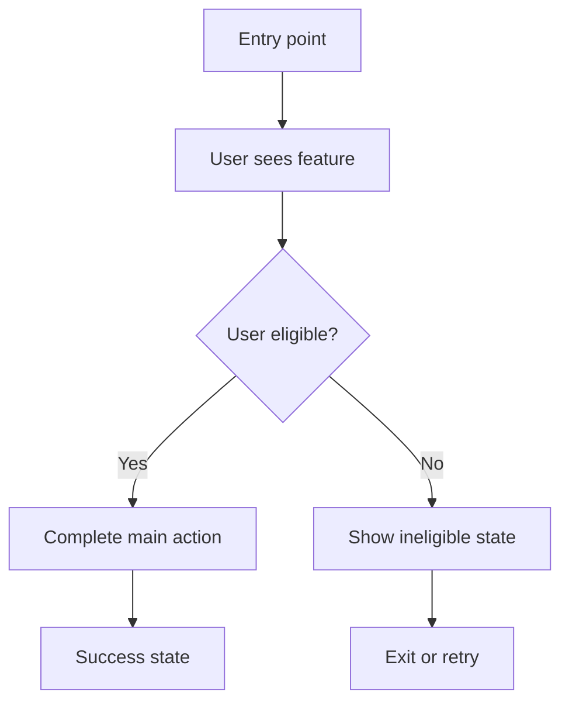

# User Flow

## Legend

| Shape | Meaning |
|---|---|
| Rectangle | Screen, state, or action |
| Diamond | Decision point |
| Labeled arrow | Condition or transition |

## Notes

- Keep the Mermaid block renderable in GitHub-compatible Markdown.
- Keep labels short enough to read in a rendered diagram.
- Put long explanations here instead of inside node labels.
